# 컴퓨터의 발전

## 초기의 계산기 - 주판(Abacus)

* 기원전 3000년 ~ 2500년 추정
* 로마인: Calculi라 부름

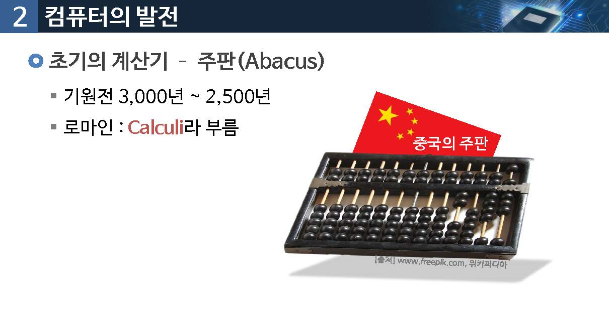

## 파스칼의 톱니바퀴 계산기

* 1645년 발전
* 톱니바퀴 회전원리를 이용
* 최조의 `기계식` 계산기 (10진수의 덧셈과 뺄셈)
* 라이프니츠가 이를 개선(곱센과 나눗셈)

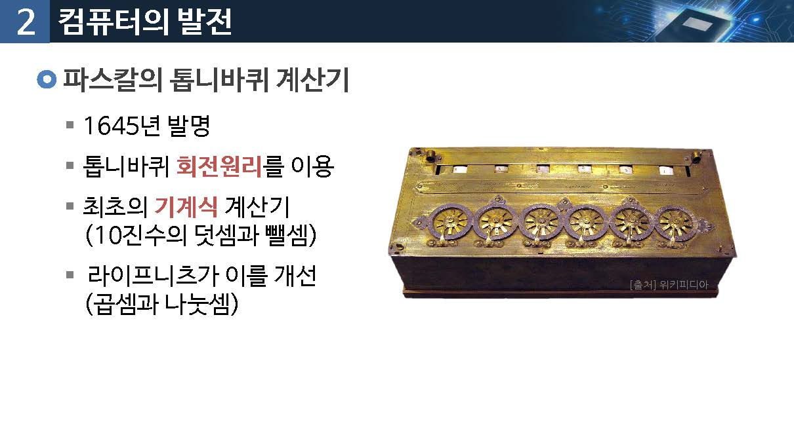

## 찰스 베비지의 차분엔진

* Difference  Engine : 1822년 프랑스 직공 재쿼드와 함께 개발
* 매우 큰 수학적 표를 계산하는 기계적인 방법
* 로그함수, 삼각함수의 계산 가능
* 기억, 연산, 입출력 장치 등을 갖춤

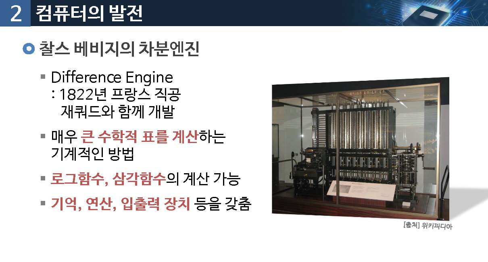

## 엘런 튜딩(alan turing)

알로기즘과 계산 개념을 튜링 기계라는 수학적 개념을 고안(1945)

알려진 수학적 개념과 계산을 튜링 기계를 통해 표현할 수 있음을 증명

범용(프로그램 내장식) 컴퓨터를 위한 기초적인 모델을 제시

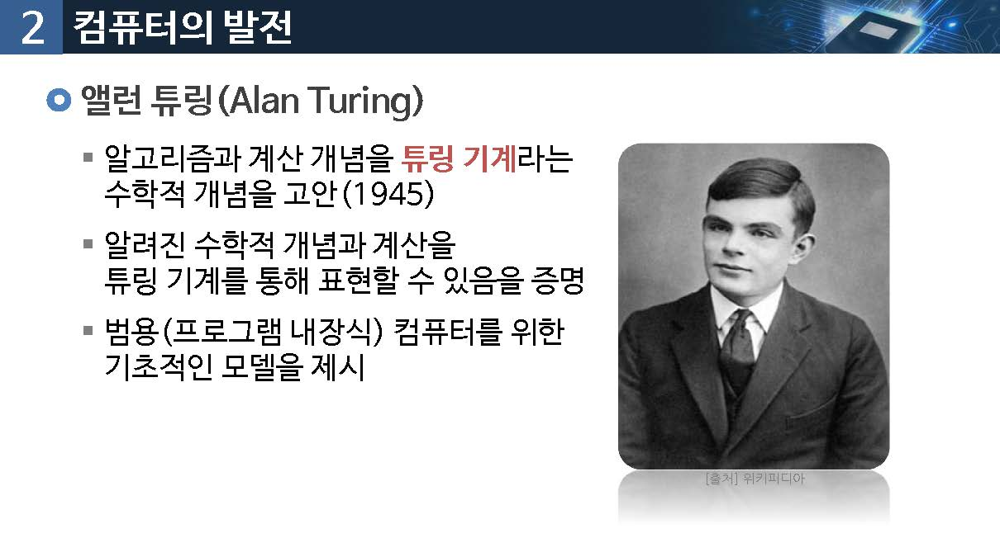

튜링기계

* Universal Computing Machine
* 데이프를 가지고 있는 유한 상태의 기계
* 테이프에는 부호를 기록, 읽기, 변경할 수 도 있음

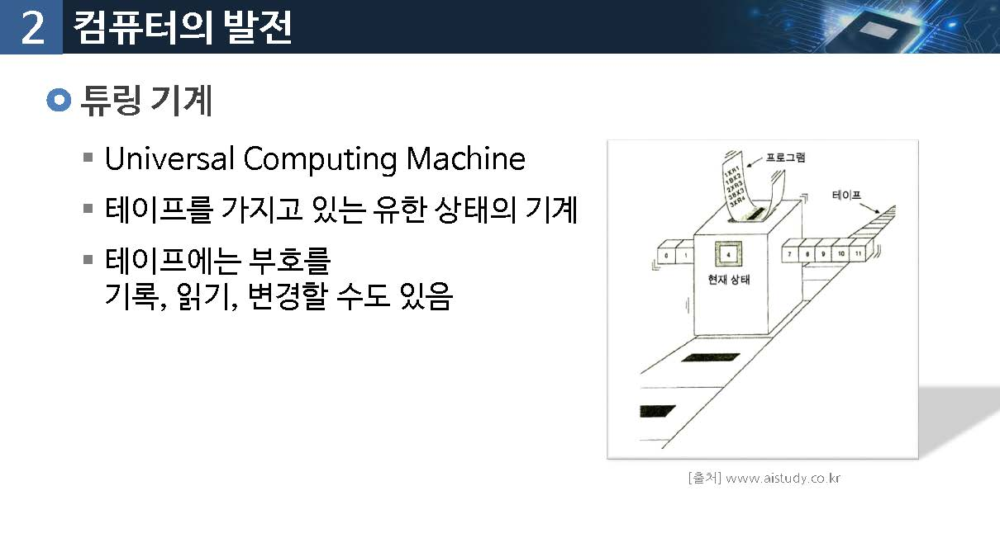

## ABC (Atanasoff-berry Computer)

* 아이오와 주립대학 물리학부(1939)
* 최조의 전자식 컴퓨터(1939)
* 선형대수학의 문제를 풀기 위한 목적으로 개발

특징

* 이진수의 사용
* 모든 계산을 전자 계산함
* 계산부와 메모리의 분리

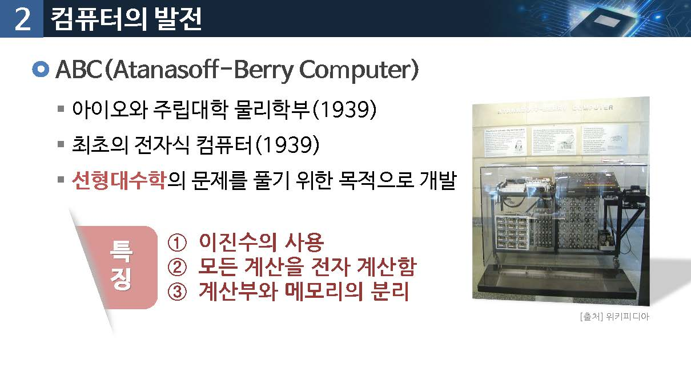

## 마크-I

1942년 하바드대학 하워드 에이킨

베비지의 설계를 기초로 계전기와 스위치, 전동기 등을 이용하여 구현

미국 해군의 단도 계산에 이용

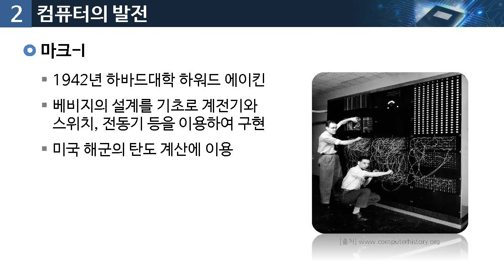

##  애니악(Eniac)

Electronic Numberical Integrator and Computer

전기기술과 결합되면서 전자회로를 사용한 컴퓨터의 등장

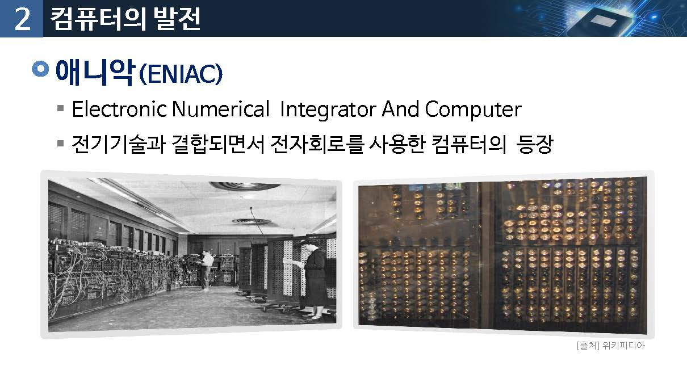

## 폰노이만(1903~1957)

현재와 같은 CPU, 메모리, 프로그램 구조를 갖는 범용 컴퓨터 구조 확립

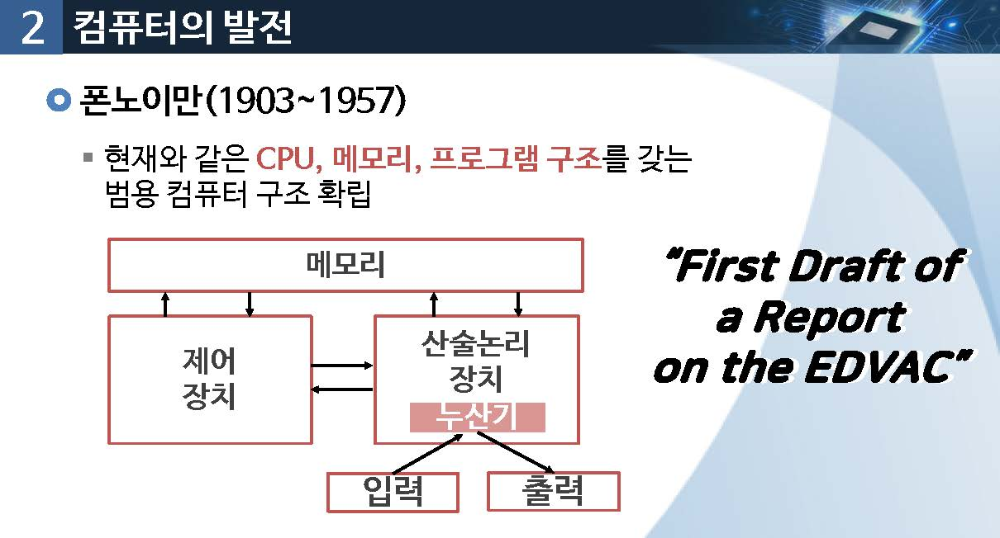

## EDSAC, EDVAC

최초의 프로그램 내장방식 컴퓨터 (1949)

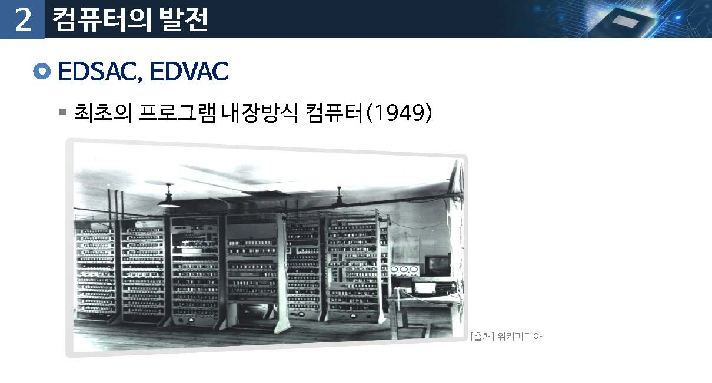

## 제1세대 컴퓨터 (1951~1958)

진공간(Vacuum Tube)이 컴퓨터 회로 소자에 사용

수천개의 진공관을 사용해서 전력 소모 및 열이 많이 발생

주기억장기에 자기드럼, 입출력 보조 기억장치로 천공 카드 사용

프로그램은 기계어를 사용해서 작성

ENIAC, EDVAC, IBM650 등

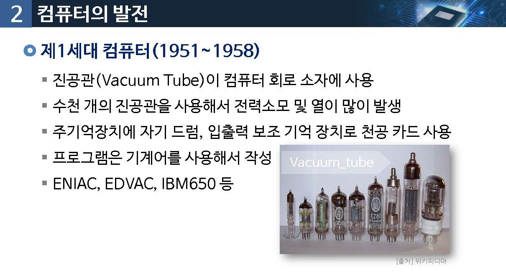

## 제2세대 컴퓨터(1958~1963)

회로소자로 트랜지스터를 사용

주기억장치에 자기코어, 보조기억장치로 용량이 큰 자기드럼, 자기 디스크

입출력 장치로 자기 테이프. 종이카드 사용

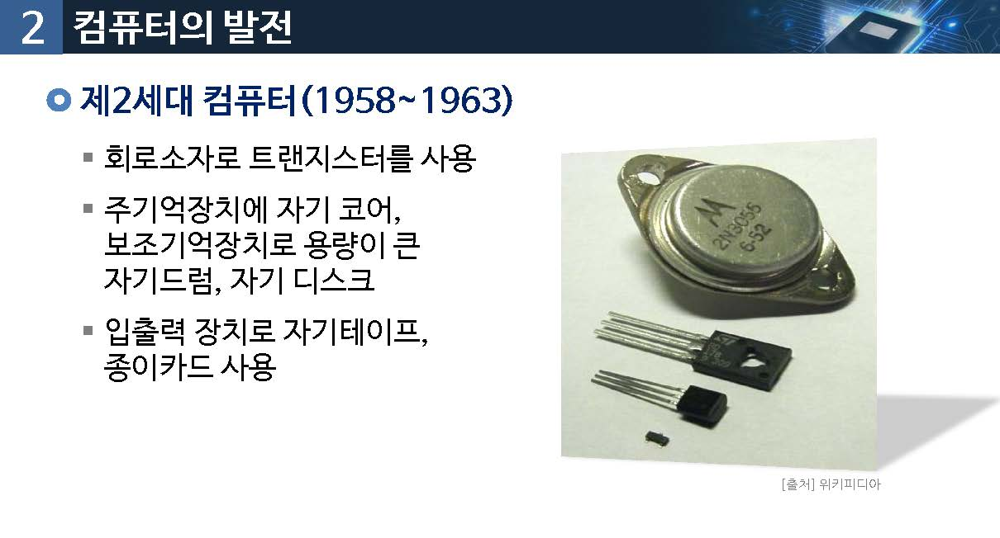

IBM 1401, IBM 7070, UNIVAC 110/220 시리즈, ㅊㅇㅊ

코볼, 포트란, ALGOL 등 프로그램 언어의 출현

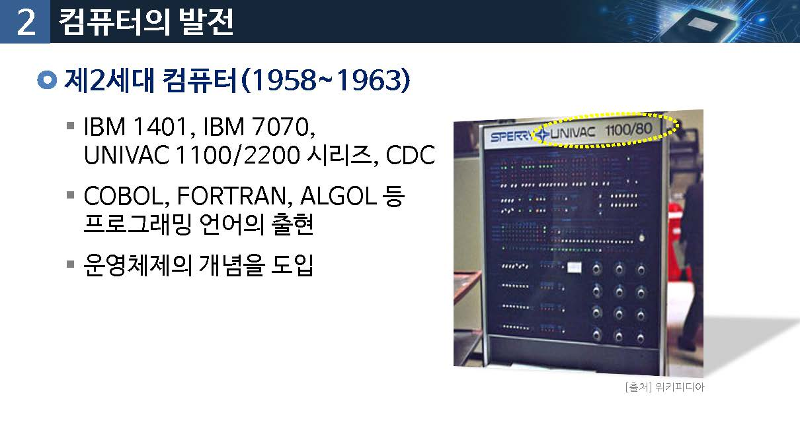

## 제3세대 컴퓨터(1965~1074)

회로 소자로 직접회로(ic:intergrated circuit) 사용

1971년 인텔사 - 초소형 전자회로 intel 4004 마이크로 프로세서 개발

중앙처리장치는 소형화 되는 반면에 기억용량은 증대

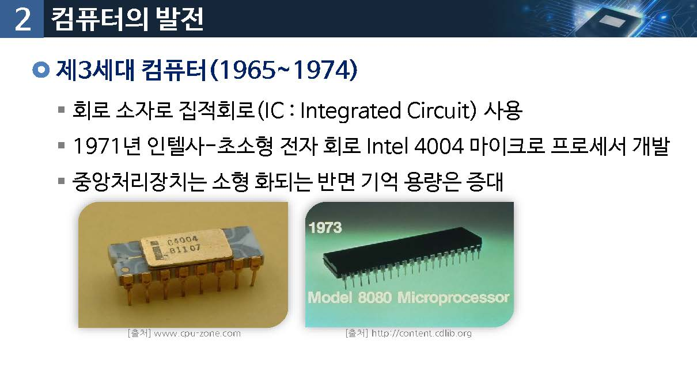

IBM S/360 (1964년), PDP-11(1960년대말)

중앙의 대형 컴퓨터를 `시간적으로 분할`하여 사용하는 `시분할 방식` 실현

Basic(Beginner's All-purpose symbolic instruction code)

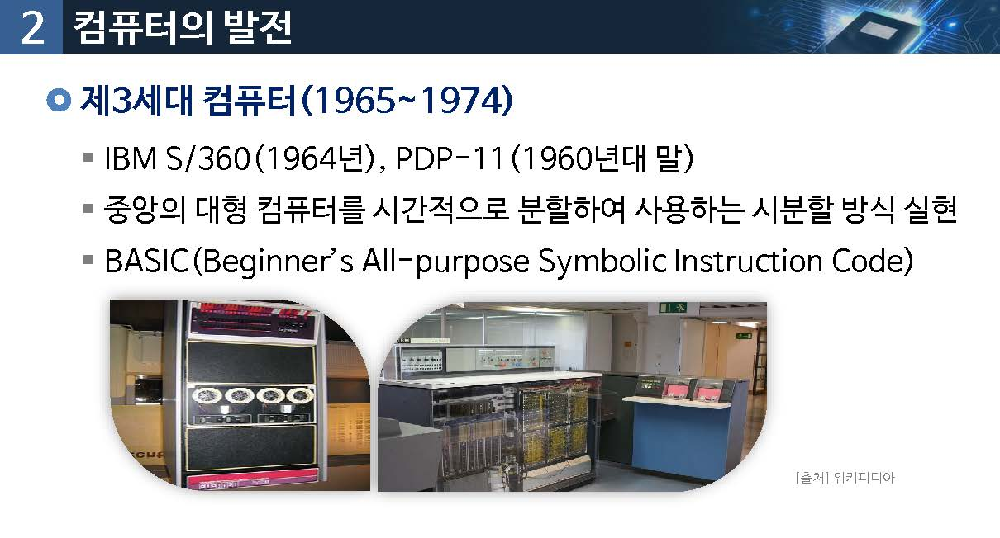

## 제 4세대 컴퓨터(1971~현재)

고밀도 직접회로(LSI)와 초고밀도 직접회로 (VSLI)를 사용

18000개의 회로 소자가 VLSI 칩 하나에 압축

1980년대 퍼스널 컴퓨터(PC)

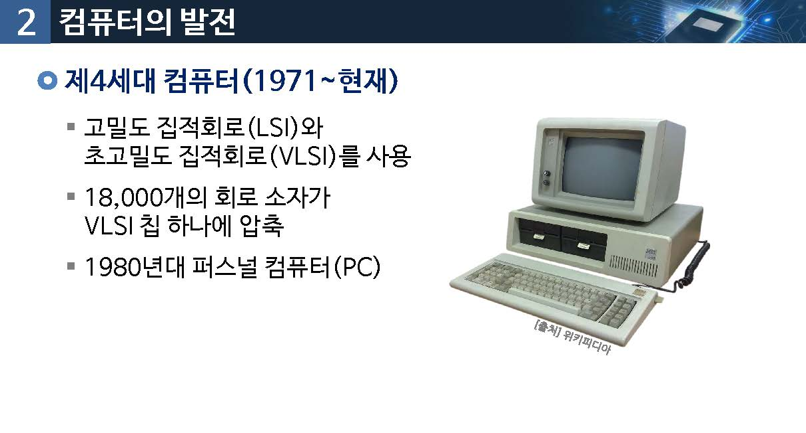

## 제 5세대 컴퓨터 (현재)

초 고밀도 집적회로(VLSI)를 사용

초고속 통신과 인터넷, 소프트웨어 플랫폼 비중이 커짐

음성입력

스마트폰, 스마트패드

병렬처리

인공지능

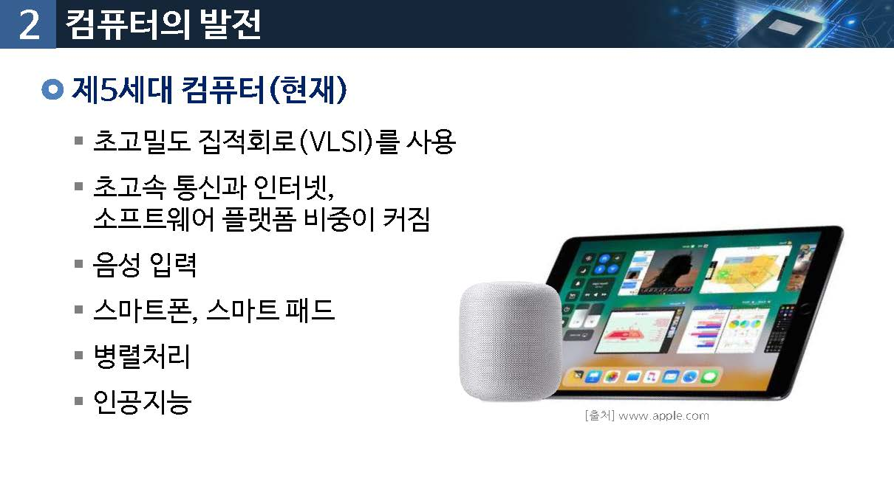

### 컴퓨터의 세대별 분류

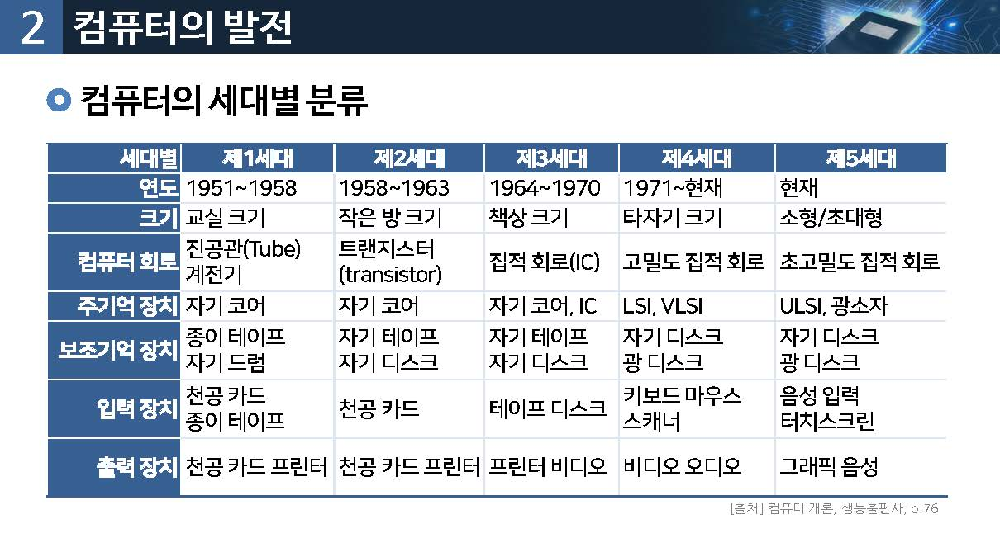

