# 컴퓨터와 정보사회

미래의 컴퓨터와 우리 사회는 어떤 모습일까요?

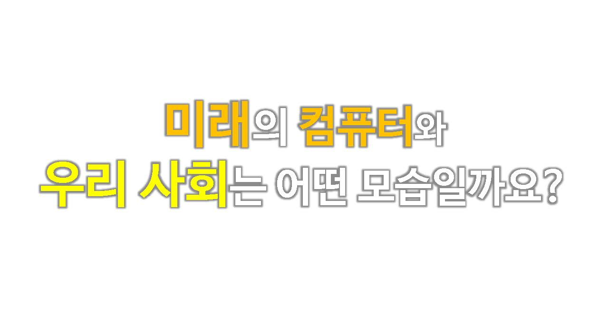

## 정보사회

#### 정보기술(infomation Technology)

정보를 여러 가지 형식으로 생산하고, 저장하고, 공유하고, 사용하는 데 있어서 이용되는 모든 종류의 기술을 말함

1990년대 실리콘 벨리를 중심으로 시작된  IT산업이 미국 경제의 핵심 산업으로 자리잡고 있으며, 전세계 산업 혁신의 원동력이 됨

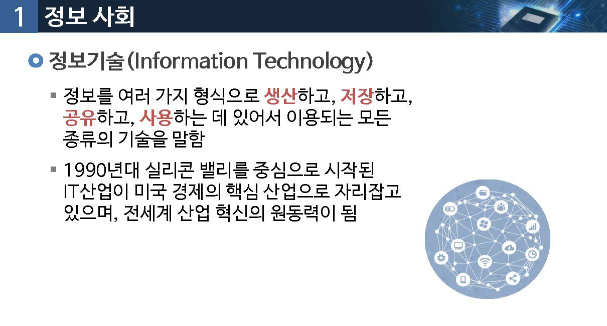

### 컴퓨터를 구성하는 핵심적인 요소
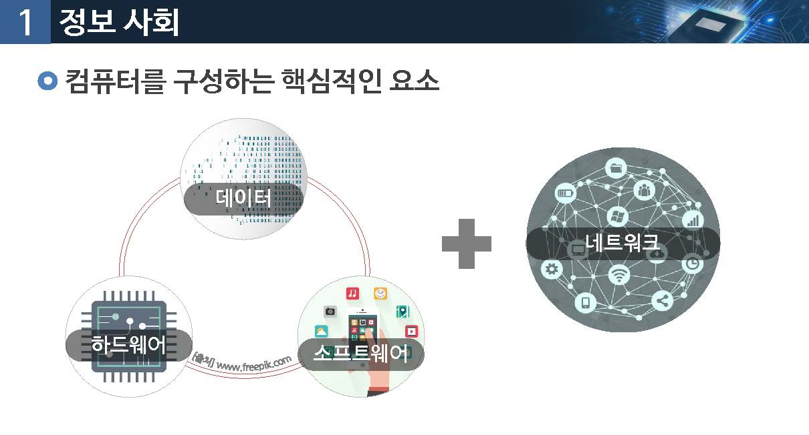

## 과거의 컴퓨터

하드웨어 중심, 소프트웨어와 데이터의 비중이 약함

하드웨어 성능과 기능이 컴퓨터의 발전을 견인함

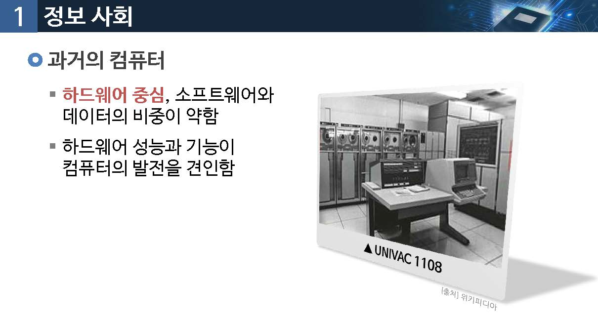

## 현재의 컴퓨터

하드웨어는 충분한 성능을 보임

인터넷, 소프트웨어 비중이 커짐

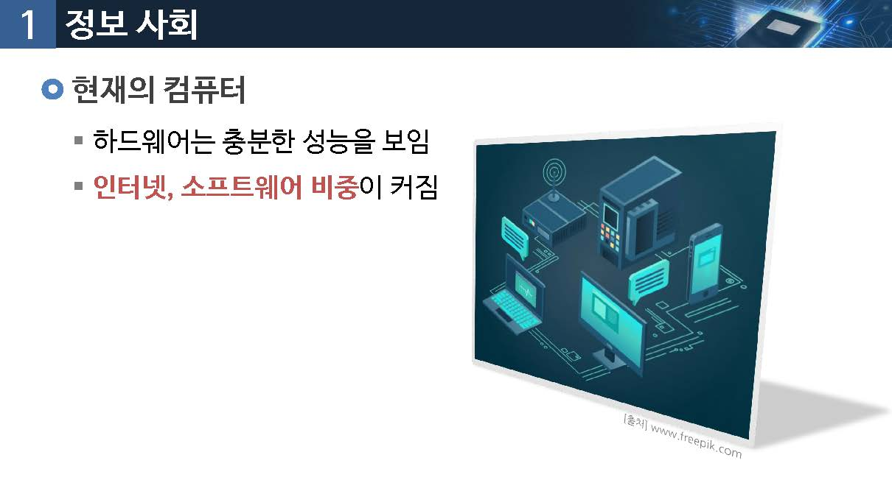

## 미래의 컴퓨터

사물인터넷: 모든 기기의 연결

인공지능, 분산/병렬처리,빅데이터 처리

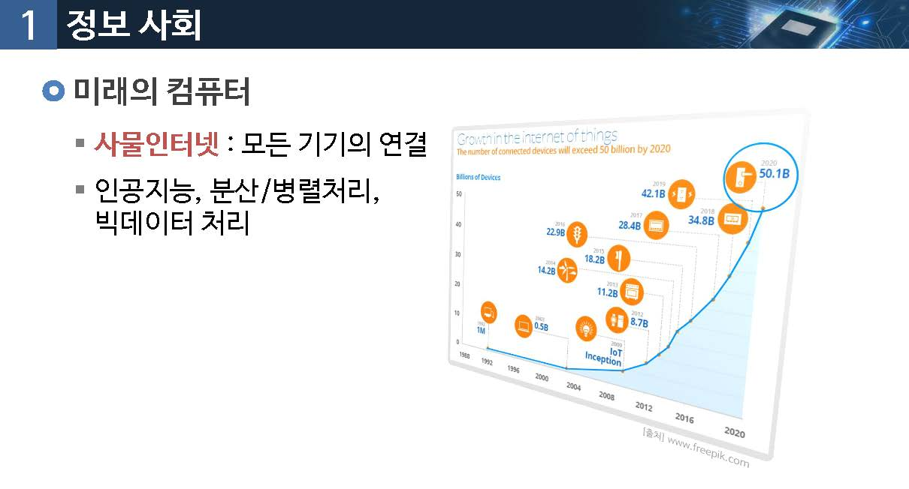

## 디지털 혁명과 시화변화

농업사회

산업사회

정보사회

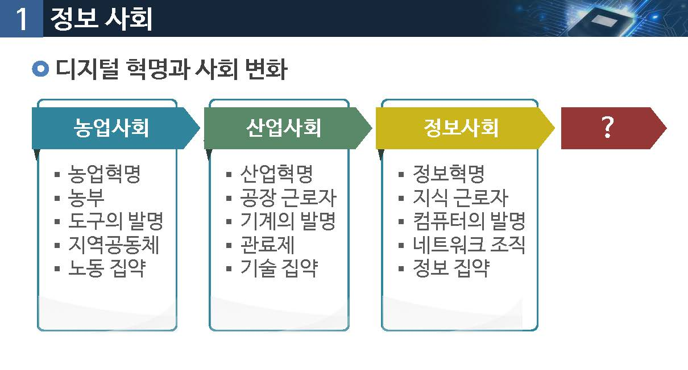

#### 정보사회

정보화

* 정보통신 시술 혁신을 배경
* 정보생산과 활용을 사회 전분야로 확산

정보사회

* 정보의 가치가 중요하게 인식되는 사회
* 현대사회의 주요한 특징

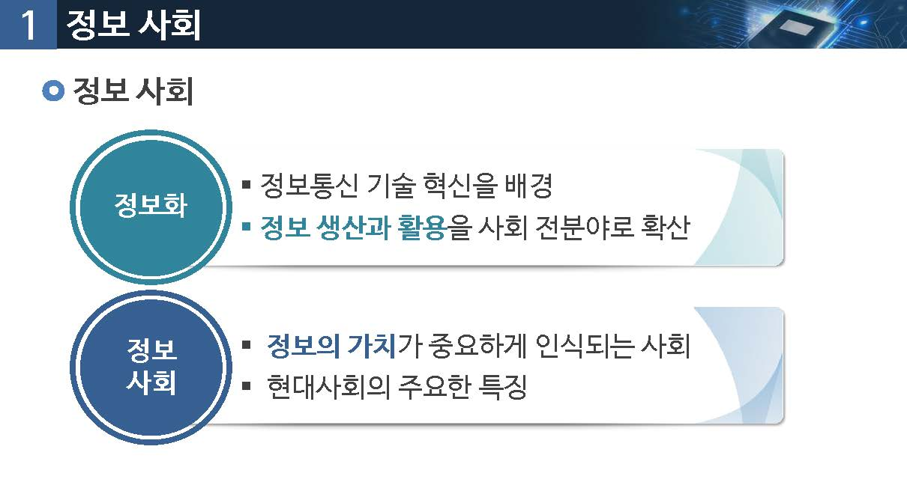

정보통신과 인터넷 기술의 발전

* 초고속 인터넷의 보편화
* 모바일 컴퓨팅과 무선인터넷 서비스가 중요 인프라
* 전자상거래는 모바일거래로 발전
* 애플, 마이크로소프트등 소프트웨어 기업을 발전
* 구글, 페이스북, 유튜브 등의 이너넷 서비스 기업의 등장
* IPTV 등 인터넷을 통한 콘덴츠 서비스 대중화
* 

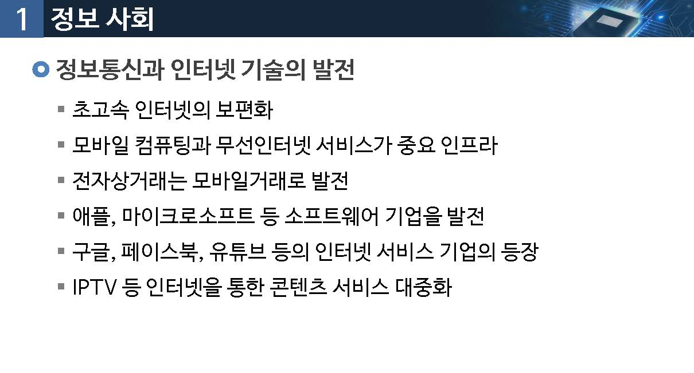

## 정보 사회의 특징

* 정보의 가치가 물질, 에너지보다 더 큰 가지를 가짐
* 정보의 축적, 처리, 전달 능력이 크게 향상
* 정보 서비스를 저비용으로 신속 편리하게 제공
* 대량의 정보가 유통되는 사회
* 제품의 생산 보다는 정보의 가능 처리가 더 많은 가치를 가짐
* 사회의 모든 구성원들이 정보를 쉽게 접할 수 있는 사회
* 

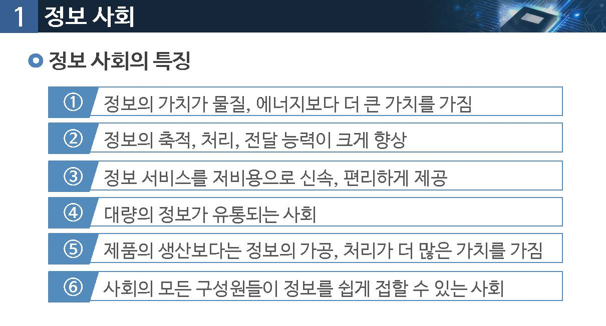

## 정보 선진 사회

* 정보기반(infomation-base)

* 무형자산(intangible Assets)

* 정보집약적 서비스(infomation-intensive services)

* 공공부분 정보서비스 투자 : GDP 의 70% 이상

  

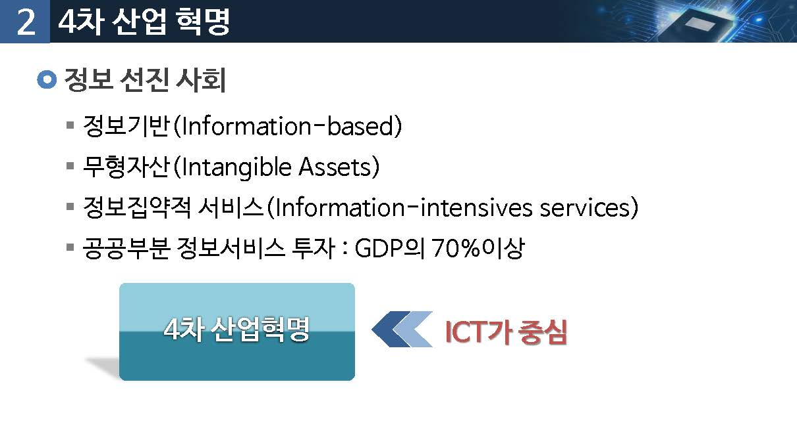

## 4차산업혁명

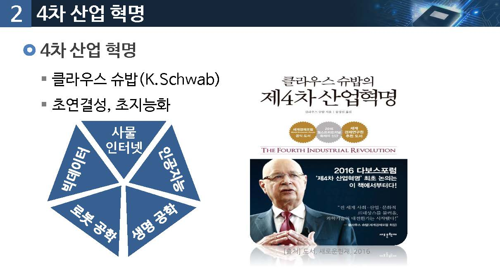

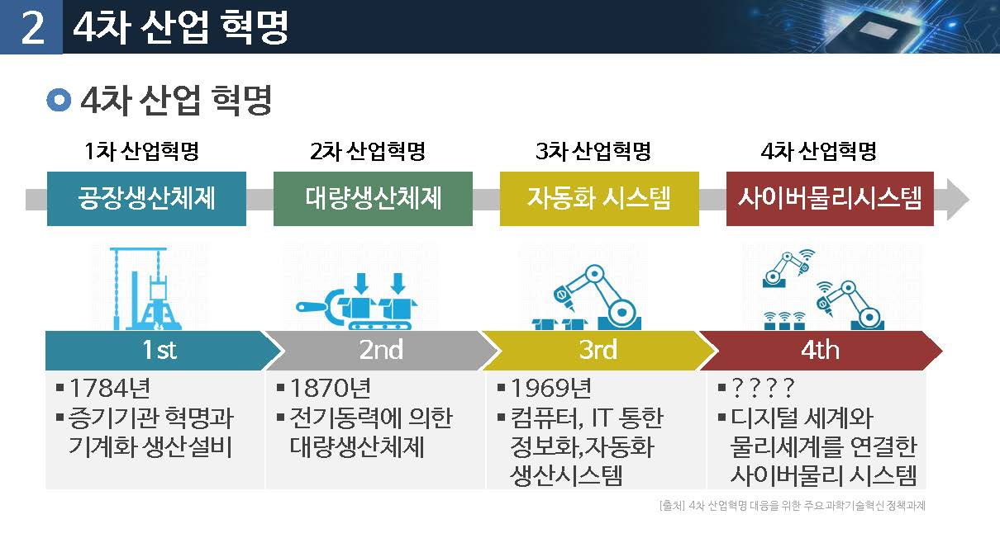

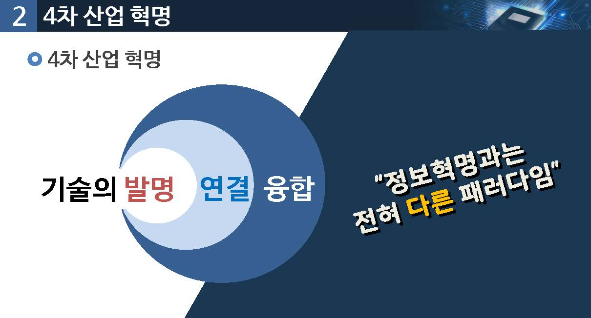

우리가 함께 배우고 생각해야 하는 것

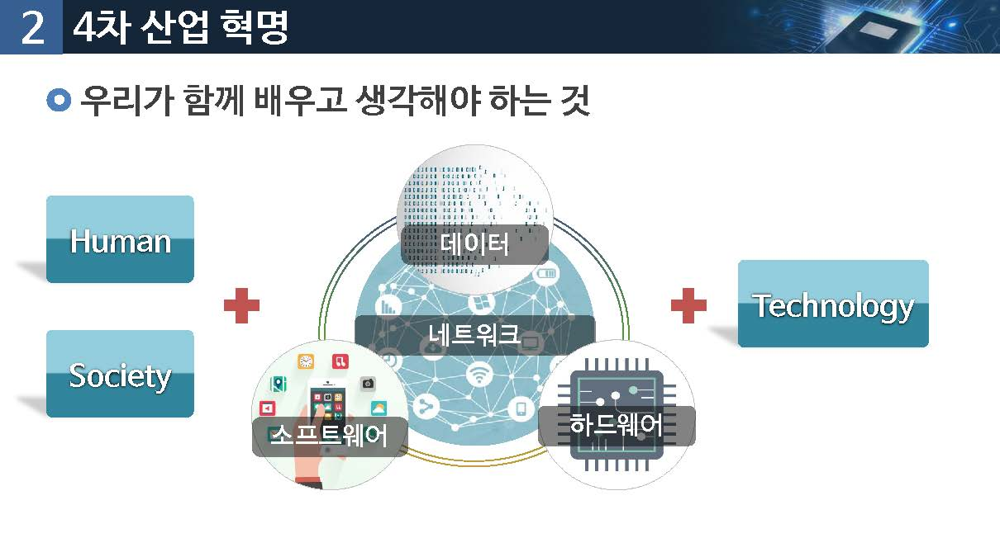