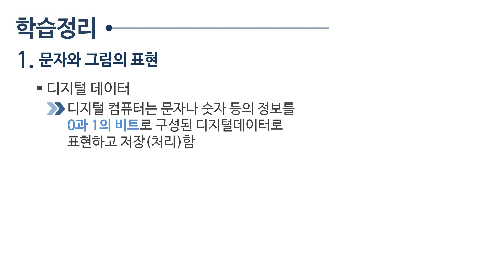
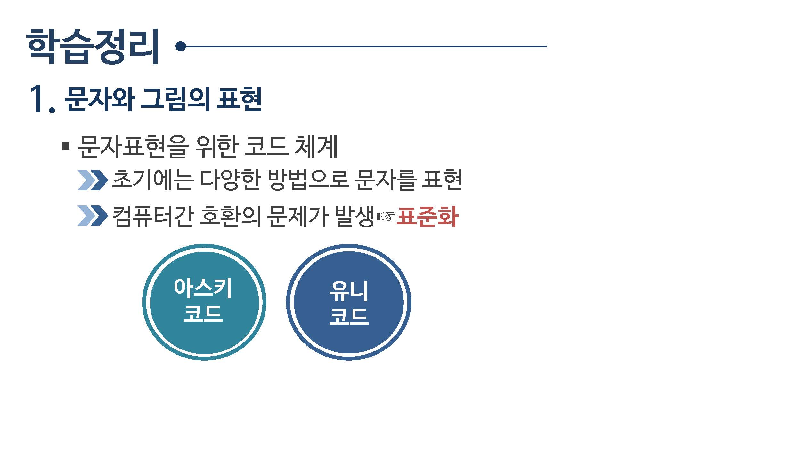
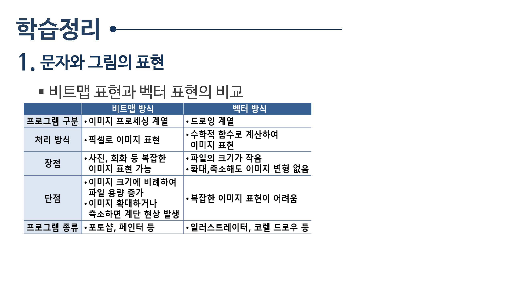
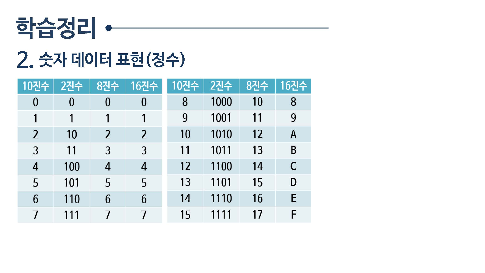
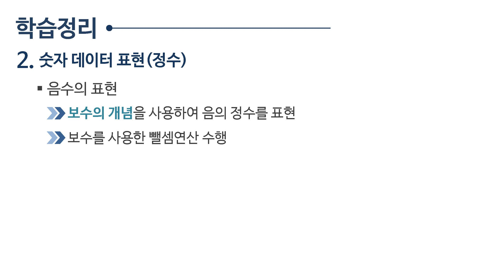
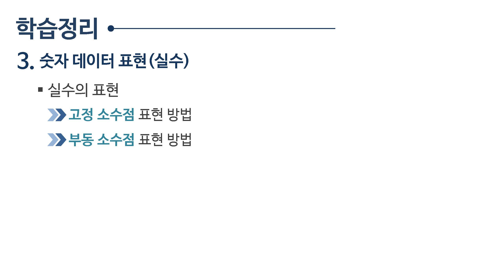
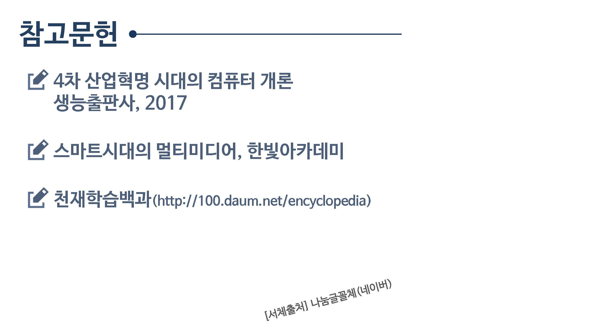

# 02.정보의 표현

 학습목표

* 코드의 개념을 이해하고, `문자 데이터의 표현 방법`을 알아봅니다.
* `그림데이터 표현`을 위한 비트맵과 백터 방식의 차이를 알아 봅니다.
* 숫자 데이터 표현을 위한 이진법의 원리을 알라보고, 이진수의 연산을 수행합니다.

학습내용

* 문자와 그림의 표현
* `정수` 숫자 데이터
* `실수` 숫자 데이터

## 02.1 문자와 그림의 표현

## 02.2 정수 데이터 표현

## 02.3 실수 데이터 표현

## 학습정리

