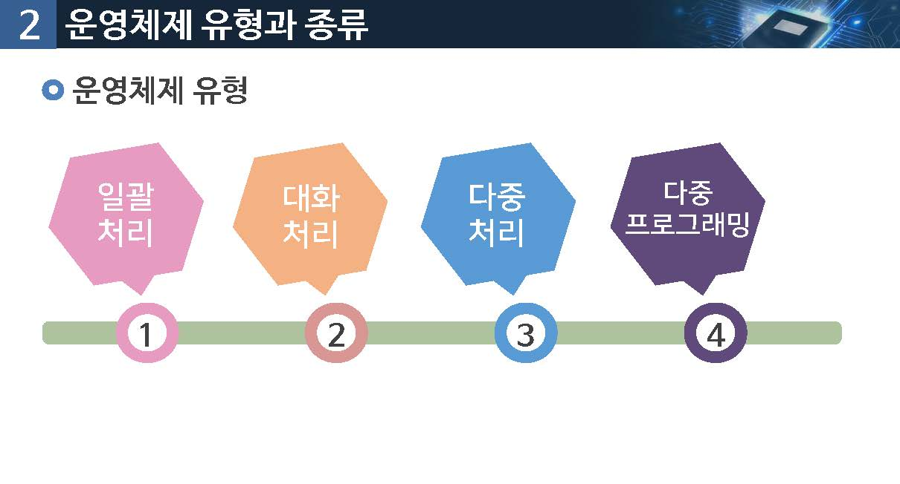
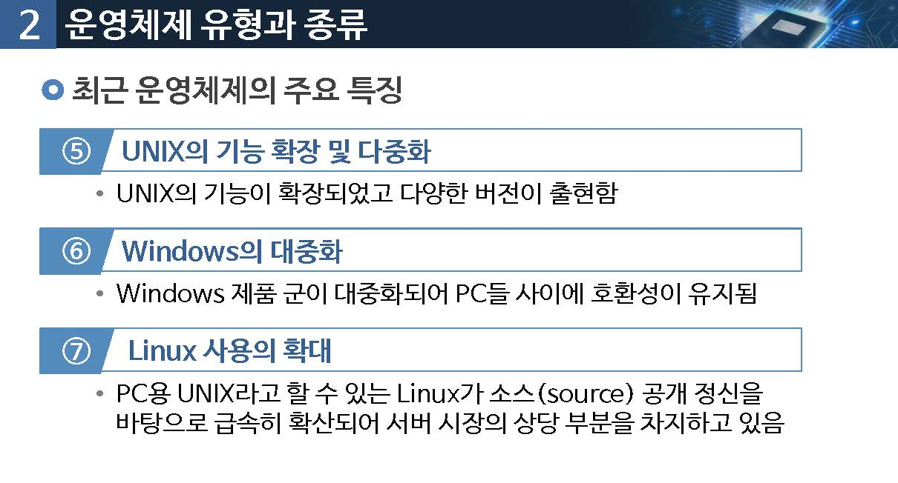
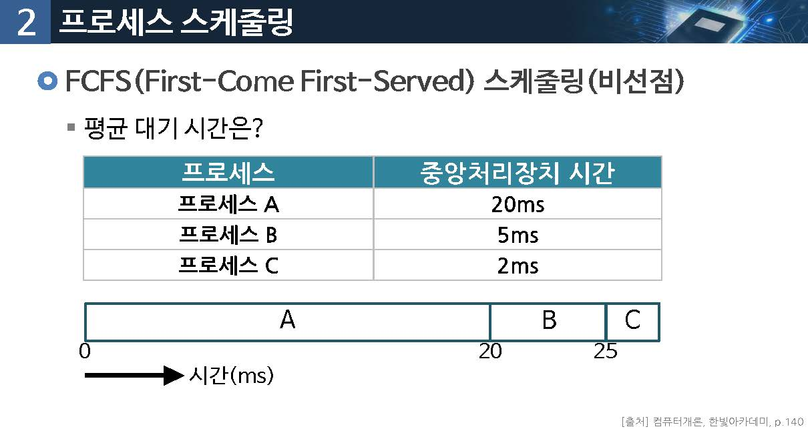
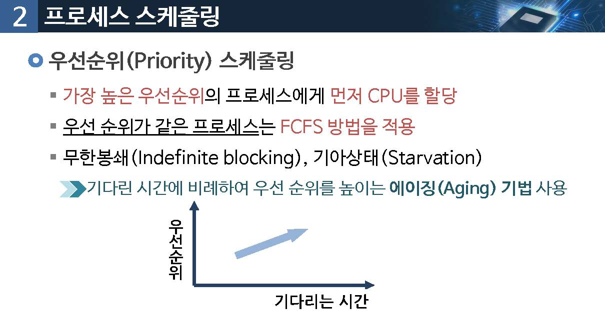

# 04.운영체제

학습목표

* 운영체제의 전반적인 기능을 설명할 수 있다.
* 프로세스 관리 방법을 이해하고, 프로세스의 평균대기기간을 산정할 수 있다.
* 운영체제가 메모리와 파일을 관리 하는 방법을 설명할 수 있다.

학습내용

* 운영체제 개요
* 프로세서 관리와 스케줄링
* 주기억장치와 파일 관리

## 운영체제 개요

운영체제가 제공하는 기능은 어떤 것이 있을까요?

## 프로세스 관리와 스케줄링

운영체제는 어떤 여러 소프트웨어를 동시에 실행 시킬 수 있을까요?

## 주기억장치와 파일관리

주기억장치보다 큰 프로그램은 어떻게 실행 기킬 수 있을까요?

## 학습정리

