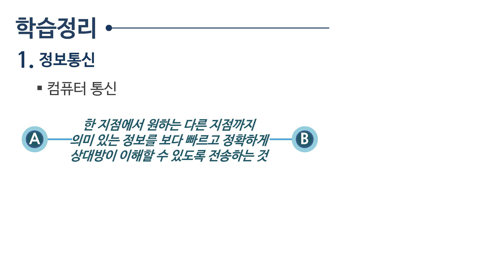
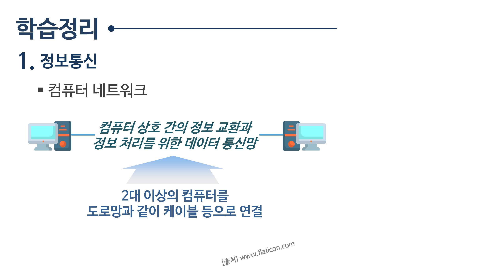
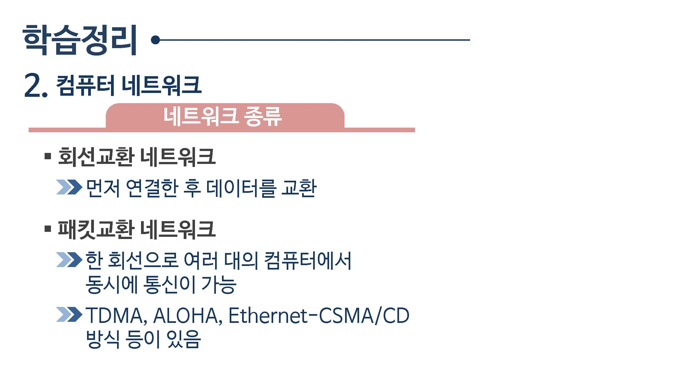
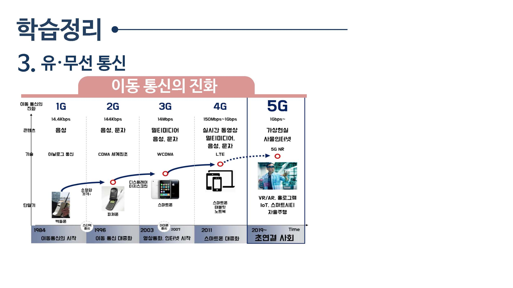

# 컴퓨터통신

학습목표

* 컴퓨터 통신에 대해서 이해하고, 통신 방식을 설명할 수 있다.
* 패킷교환 네트워크와 회선교환 네트워크 방식의 차이를 설명할 수 있다.
* 이동통신의 발전 과정을 살펴보고 5G이동통신의 특징을 설명할 수 있다.

## 학습내용

* 정보통신
* 컴퓨터 네트워크
* 유무선 통신

## 학습정리

정보통신

텀퓨터 통신

한지점에서 원하는 다름 지점까지 의미 있는 정보를 보다 빠르고 정확하게 상대방이 이해 할 수 있도록 전송하는 것

컴퓨터 네트워크

