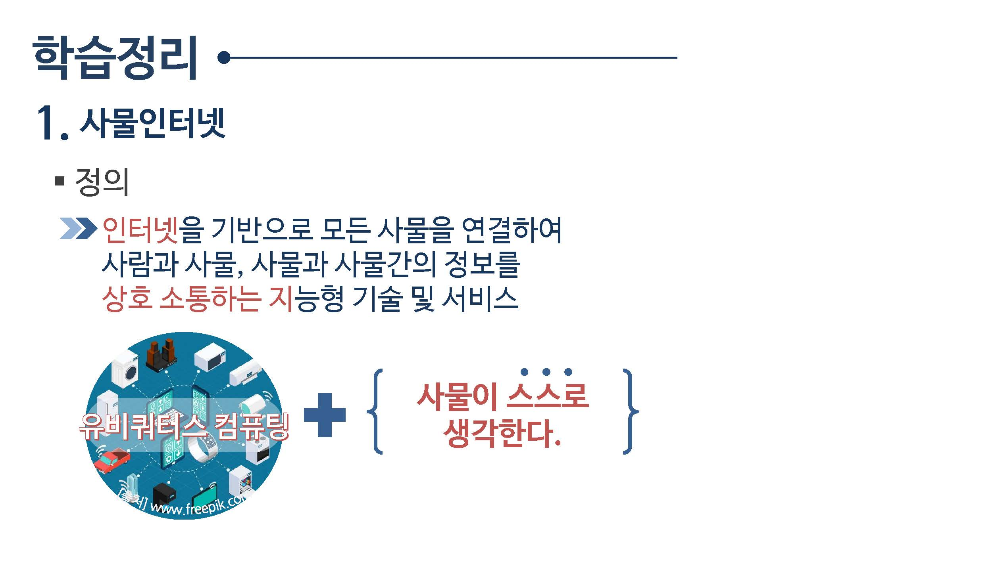
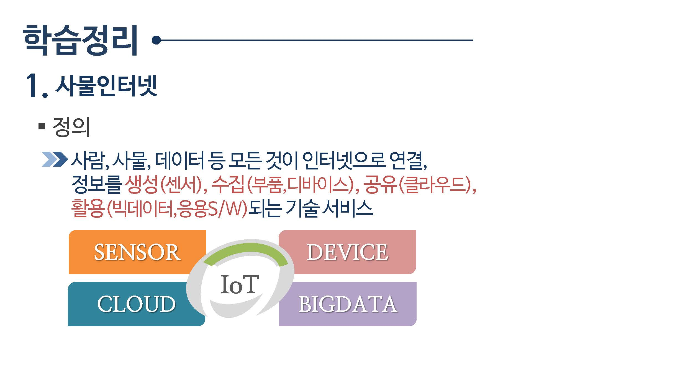
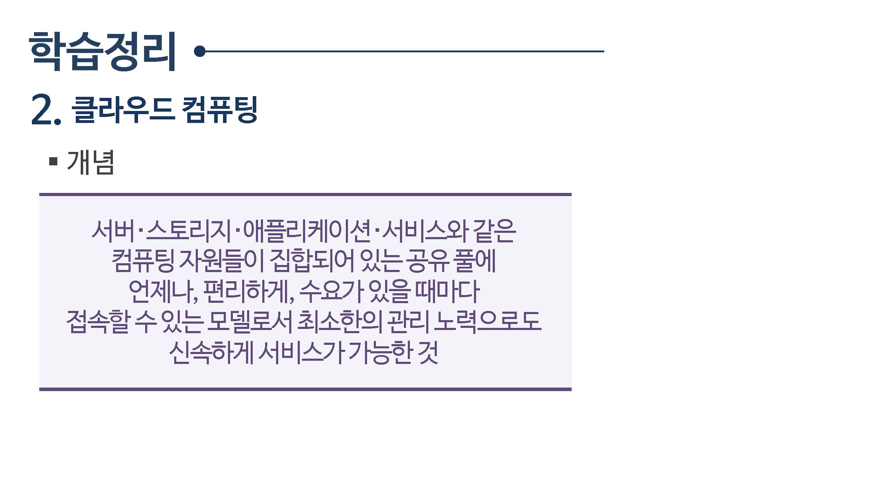
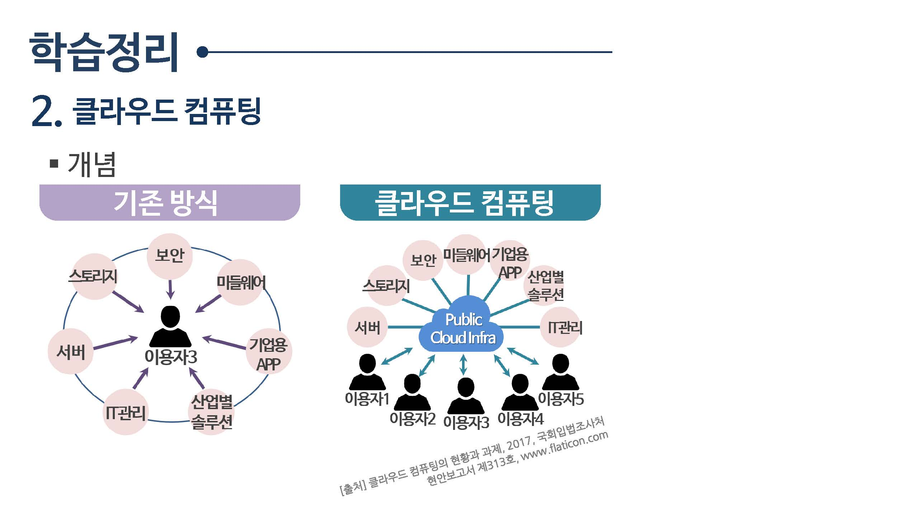
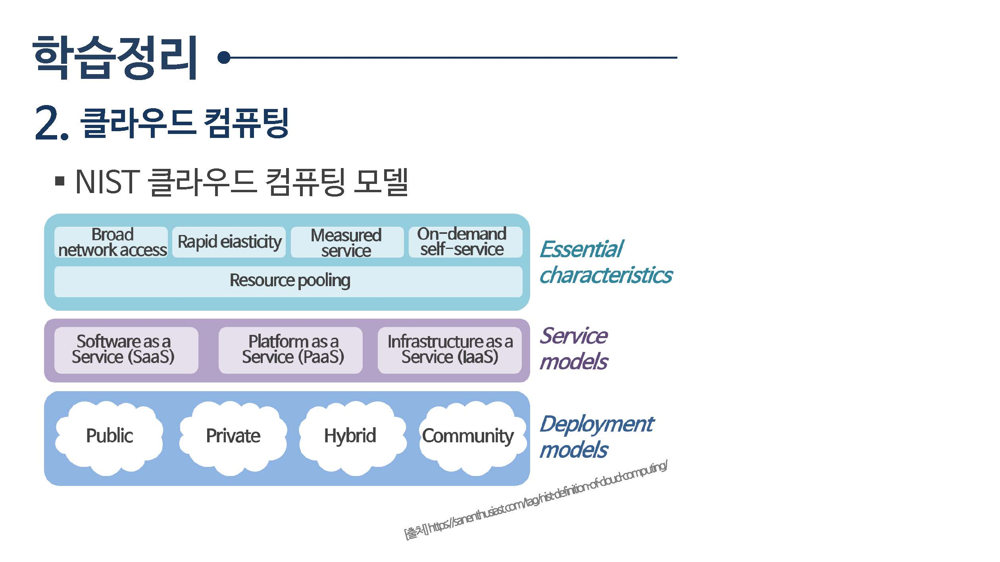

# 클라우드

## [사물인터넷](사물인터넷)

사물인터넷

정의: 인터넷을 기반으로 모든 사물을 연결하여 사람들과 사물, 사물과 사물간의 정보를 상호 소통하는 지능형 기술 및 서비스

사물인터넷 : 사람, 사물, 데이터 등 모든 것이 인터넷으로 연결,

정보를 생성(센서), 수집(부품, 디바이스), 공유(클라우드), 활용(빅데이터, 음용S/W)되는 기술 서비스

## [클라우드 컴퓨팅](클라우드컴퓨팅)

클라우드 컴퓨팅

서버 , 스토리지, 애플리케이션, 서비스와 같은 컴퓨팅 자원들이 집합되어 있는 공유 풀에 언제나, 편리하게, 수요가 있을 때마다

접속할 수 있는 모델로서 최소한의 관리 노력으로도 신속하게 서비스가 가능한것

클라우드 컴퓨팅 개념

* 기존방식
* 클라우스 컴퓨팅

NIST 클라우드 컴퓨팅 모델

