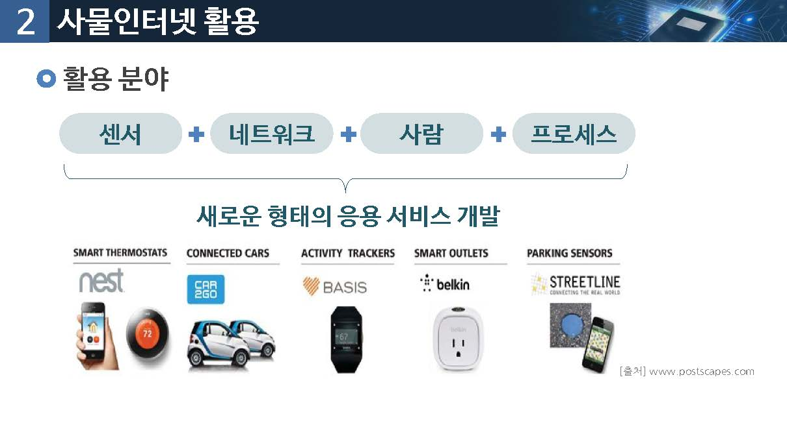

# 사물인터넷
사물인터넷의 핵심기술은 무엇일까요?

## 01.사물인터넷 개요

### 유비쿼터스(Ubiquitous) 컴퓨팅

> Ubiquitous : "(신은) 어디에너 널리 존재한다 "

* 언제 어디서든 어떤 기기를 통해서도 컴퓨팅을 할 수 있는 것

* 1988년 마크 와이저(제록스) : 네트워크 기반의 차세대 컴퓨팅 환경

"사물과 컴퓨터를 연결하는 정보 기술 패러다임"

### 사물인터넷(Internet of Thing) 정의1

인터넷을 기반으로 모든 사물을 연결하여 사람과 사물, 사물과 사물간의 정보를 상호 소통하는` 지능형 기술 및 서비스`

### 사물인터넷 정의2

사람, 사물, 데이터 등 모든 것이 인터넷으로 연결, 정보를 생성(센서), 수집(부품, 디바이스), 공유(클라우드), 활용(빅데이터,응용 S/W)되는 기술 서비스

### 사물 인터넷 개념의 발전

### 사물인터넷 핵심 구성요소

### 센서 및 액추에이터 (Sensors & Actuators)

### 센서 및 엑추에이터 - MEMS (Micro Electro Mechanical Systems)

반도체 칩에 내장된 아주 작은 기계장치와 컴퓨터를 결합하는 기술

> 센서, 셀브, 기어, 반사경, 구동기등...

소형화, 지능화가 요구되는 미래 환경에 대응하기 위한 핵심기술

사물인터넷 분야의 핵심 요소인 센서 및 구동 장치 등을 초소형화, 고성능화, 고집적화, 복합화를 가능하게 하는 시스템화된 기술

### 연결 네트워크(connectivity)

* 저전력 네트워킹과 물리적으로 어떠한 환경에서도 안정적으로 데이터를 수비하고 제공

* Zifbee와 같은 경량화 통신 프로토콜들이 사용되기 시작

* 인터넷을 기반으로 자원 제약적 사물들이 포함된 사물인터넷 내의 모든 사물들을 연결하기 위해서는 TCP/IP기반의 인터넷 프로토콜 기술들이 필요

### 사물 인터넷 개요

## 02.사물인터넷 활용

