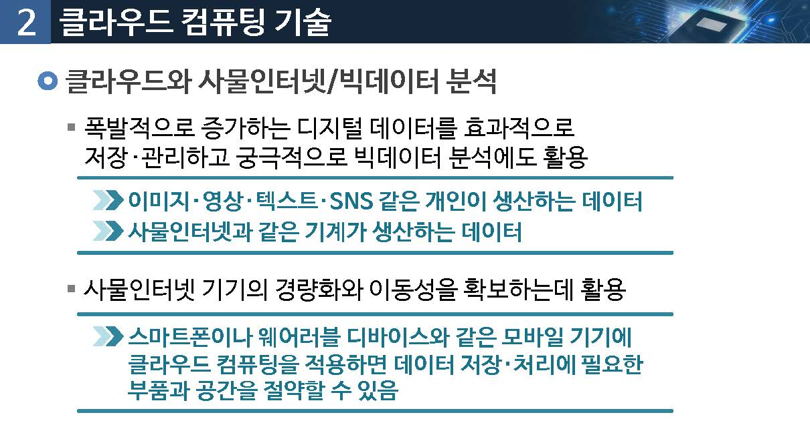

# 클라우드 컴퓨팅

사물인터넷과 클라우딩 컴퓨팅은 어떤 관계일까요?

## 01.클라우드 컴퓨팅 정의

### 클라우드 컴퓨팅(Cloud Computing)

* H/W, S/W, 어플리케이션의 정보자원을 `필요에 따라 빌려 활용`함
* 사용한 많큼 비용을 지불 : 사용하는 정보자원이 어떻게 운영 관리 되는지 알 필요 없음

> Gartner : 확장성이 있고 유연한 IT를 가능하게 하는 기능들이 인터넷을 사용하는 외부의 고객들에게 서비스로 제공되는 컴퓨팅 방식

> 포레스트 리서치 : 인터넷 기술을 통해 사용량에 따라 과금하거나 셀프 서비스를 하는 방식으로 제공되는 표준화된 IT 기능

### 정의

미국 국립표준기술원(NIST) : National Institute of Standard and Technology

"서버, 스코리지, 애플리케이션, 서비스와 같은 컴퓨팅 자원들이 집합되어 있는 공유 풀에 언제나, 편리하게, 수요가 있을 때 마다 접속할 수 있는 모델로서 최소한의 관리 노력으로도 신속하게 서비스가 가능한 것" 

### 클라우드 컴퓨팅 개념

### 클라우드 컴퓨팅 정의

* 구글 드라이브
* 카카오 내비
* 아마존 웹서비스

### NIST 클라우드 컴퓨팅 모델

### 핵심특징

* 주문형 셀프 서비스

사용자는 클라우드 서비스 공급자와 개인적인 접혹 없이도 컴퓨터 자원을 사용할 수 있어야 함

* 광대역 네트워크 접근

클라우드 시스템의 자원에 접근하는 것은 사용자들이 플랫폼에 독립적으로 접근한다는 것을 의미함

(랩탑, 휴대폰, PDA등)

## 02.클라우드 컴퓨팅 기술

