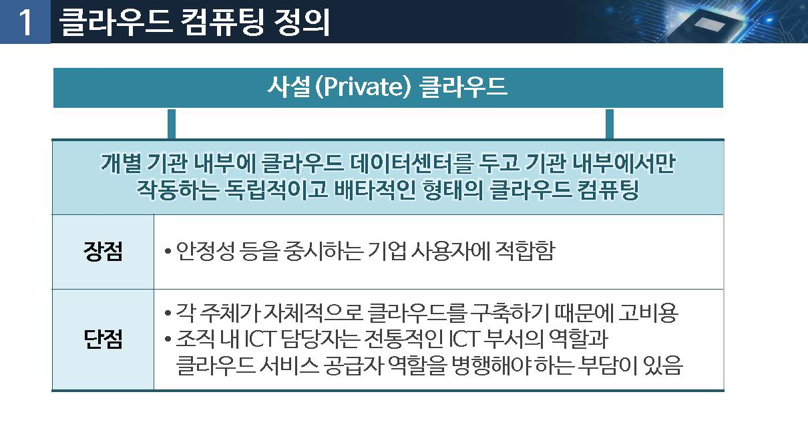
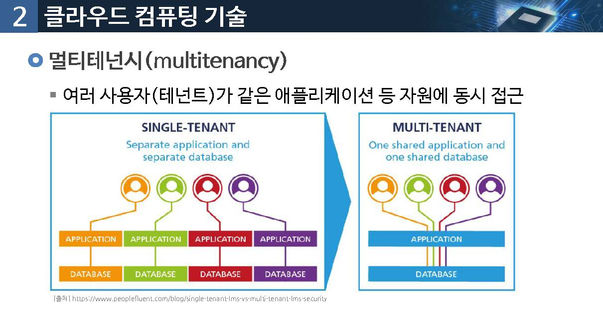

# 클라우드 컴퓨팅

사물인터넷과 클라우딩 컴퓨팅은 어떤 관계일까요?

## 01.클라우드 컴퓨팅 정의

### 클라우드 컴퓨팅(Cloud Computing)

* H/W, S/W, 어플리케이션의 정보자원을 `필요에 따라 빌려 활용`함
* 사용한 많큼 비용을 지불 : 사용하는 정보자원이 어떻게 운영 관리 되는지 알 필요 없음

> Gartner : 확장성이 있고 유연한 IT를 가능하게 하는 기능들이 인터넷을 사용하는 외부의 고객들에게 서비스로 제공되는 컴퓨팅 방식

> 포레스트 리서치 : 인터넷 기술을 통해 사용량에 따라 과금하거나 셀프 서비스를 하는 방식으로 제공되는 표준화된 IT 기능

### 정의

미국 국립표준기술원(NIST) : National Institute of Standard and Technology

"서버, 스코리지, 애플리케이션, 서비스와 같은 컴퓨팅 자원들이 집합되어 있는 공유 풀에 언제나, 편리하게, 수요가 있을 때 마다 접속할 수 있는 모델로서 최소한의 관리 노력으로도 신속하게 서비스가 가능한 것" 

### 클라우드 컴퓨팅 개념

### 클라우드 컴퓨팅 정의

* 구글 드라이브
* 카카오 내비
* 아마존 웹서비스

### NIST 클라우드 컴퓨팅 모델

### 핵심특징

* 주문형 셀프 서비스

사용자는 클라우드 서비스 공급자와 개인적인 접혹 없이도 컴퓨터 자원을 사용할 수 있어야 함

* 광대역 네트워크 접근

클라우드 시스템의 자원에 접근하는 것은 사용자들이 플랫폼에 독립적으로 접근한다는 것을 의미함

(랩탑, 휴대폰, PDA등)

자원풀링

* 멀티테넌트(multi-tenant) 사용을 지원하는 시스템에서 공유할 수 있는 지원을 생성하며, 물리적 시스템과 가상 시스템은 필요에 따라서 유동적으로 할당 혹은 재할당함
* 풀링 개념은 가상머신, 프로세싱, 메모리, 저장 장치, 네트워크 대역과 연결 같은 자원들의 위치를 숨기기 위한 추상화 개념임

민첩한 탄력성

* 자원들은 빠르고 탄력적으로 준비될 수 있어야 함
* 가상머신은 자원을 더 나은 겅능의 컴퓨터 또는 같은 성능의 컴퓨터 둘 중에서 어떤 형태로든 자동 또는 수동으로 추가할 수 있어야 함.

종량제 서비스

* 클라우드 시스템 자원의 사용량은 측정시스템을 기반으로 해서 사용자에게 측정되고 검사되고 보고됨

  > 사용자는 저장장치 사용량, 트랜젝션의 수, 네트워크 I/O 또는 대역폭, 사용된 프로세싱의 양 등을 기반으로 비용을 지불

  

### 배치모델

클라우드 컴퓨팅의 이용 목적과 클라우드 시스템이 어디에 위치해 있는지에 대한 정의

* 사설(private) 클라우드
* 공공(public) 클라우드
* 하이브리드(Hybrid) 클라우드
* 커뮤니티(Community) 클라우드

#### 사설 클라우드

개별 기관 내부에 클라우드 데이터센터를 두고 기관 내부에서만 작동하는 독립적이고 배타적인 형태의 클라우드 컴퓨팅

​	장점 :

*  안정성 등을 중시하는 기업 사용자에게 적합함

  

  단점: 

* 각 주체가 자체적으로 클라우드를 구축하기 때문에 고비용

* 조직내 ICT 담당자는 전통적인 ICT 부서의 역할과 클라우드 서비스 공급자 역할을 병행해야 하는 부담이 있음.

#### 공공(public) 클라우드

일정한 자격을 갖춘 일반 일반 대중이 모두 사용할 수 있는 공용 클라우드 컴퓨팅

장점

* 개별 이용자는 자체적으로 ICT자원을 구축할 필요가 없기 때문에 저렴한 비용으로 ICT 자원을 이용할 수 있고, 수용에 따라 편리하게 서비스를 확장, 축소 할 수 있음

단점

다른 이용자와 물리적으로 구분도지 않기 때문에 상대적으로 보안에 대한 우려가 높음

## 하이브리드 클라우드

프라이빗 방식과퍼블릭 방식을 물리적, 논리적으로 결합하여 양자의 장점을 취사선택하는 방식

장점

* 다양한 결합을 통해 장점을 극대화

단점

* 프라이빗 클라우드와 퍼블릭 클라우드의 시스템, 사업자,작동환경이 일치하지는 않기 때문에 현실적으로 양자를 완벽하게 통합하여 끊임없는 서비스를 구현하는 것이 쉽지 않음

### 서비스모델

#### IaaS

* 서버,스토리지,처리장치와 같은 물리적인 컴퓨팅 인프라를 클라우드 서비스 형태로 제공하는 것
* iaas 서비스 공급자는 사용자들이 서로 다른 개발 목적을 가지고 있어도 모든 인프라를 관리함

#### Pass

* pass는 사용자에게 가상머신, 운영체제, 애플리케이션, 서비스, 개발 프레임워크, 트랜잭션, 관리 구조등을 제공
* 개발에 필요한 미들웨어나 소프트웨어를 클라우드 서비스로 제공

#### Saas

* 애플리케이션, 관리, 사용자 인터페이스를 포함하는 서비스 모델
* 씬(thin) 클라이언트 인터페이스를 통해서 사용자에게 애플리케이션을 제공

### 클라우드 컴퓨팅 장점

#### 저비용

클라우드 네워크는 고효율로 운영, 높은 활용성과 상당한 비용이 절감됨

#### 쉬운 사용성

제공되는 서비스의 형태에 따라서, 사용자는 자신의 서비스를 구현하기 위한 하드웨어 또한 소프트웨어 라이센스가 필요하지 않음

#### Qos

Qos(Quality of service)는 벤더로 부터 계약된 대로 얻을 수 있음

#### 신뢰성

* 공급자는 사용자에게 매우 신뢰성 있는 클라우드 컴퓨팅 네트워크 규모, 로드밸런싱(load balancing) 과 페일오버(fail-over)를 제공함
* 사용자가 직접 구성하는 것보다 더 신회성 있는 경우 발생함

#### 외주운영

* 클라우드 서비스로 사용자가 자신의 사업을 관리할 때 사용자의 컴퓨팅 인프라는 공급자가 관리함
* 사요자는 클라우드 서비스를 통해 IT 인력 비용 감소할 수 있음

#### 단순화된 운영과 업그레이드

* 시스템이 가상 머신에 집중화되어, 사용자는 패치와 업그레이드가 쉬움
* 사용자는 항상 최신 버전 소프트웨어 접근이 가능함

#### 낮은 진입 장벽

* 공급자의 시스템을 사용하는 것이므로 사용자는 초기에 기기를 구입할 필요가 없음

  > 따라서 초기 자본 지출 크게 감소함

* 언제든지, 누구나 대규모화 가능함

### 클라우드 컴퓨팅 단점

* 애플리케이션과 서비스를 사용할 때, 본인이 원하는 만큼 커스터마이즈도지 않은 소프트웨어를 사용함
* 모든 클라우드 애플리케이션은 WAN 연결 때문에 발생하는 고유의 대기시간을 기다려야 하는 어려움이 있음
* 

클라우드 애플리케이션에도 트랜잭션을 통일시키기 위한 서비스 브로커, 트랜잭션 관리자, 혹은 다른 미들웨어 형태의 추가적인 관리 기능이 시스템에 추가 되어야만 하는데 몇몇 클라우드 애플리케이션의 경우 매우 큰 성능이 하락됨

사용자가 클라우드 컴퓨팅 안에서 '개인정보 보호와 보안'을 스스로 관리해야 함

## 02.클라우드 컴퓨팅 기술

### 서버 가상화와 Iaas

가상화 : 하나의 사드웨어 서버위에 가상의 서버를 만드러 제공

### 멀티테넌시(multitenancy)

여러 사용자(테넌트)가 같은 애플리케이션 등 자원에 동시 접근

* 각 테너트는 다른 테넌트가 같은 애플리케이션을 사용하고 있다는 것을 인식하지 못함

* 다른 소유자 데이터와 설정 정보에 접근하지 못함

### 국내 클라우드 컴퓨팅 산업 경쟁력

### 시장 점유율

### 클라우드와 사물인터넷/빅데이터 분석

* 폭발적으로 증가하는 디지털 데이터를 효과적으로 저장, 관리하고 궁국적으로 빅데이터 분석에도 활용

> 이미지, 영상, 텍스트,SNS 같은 개인이 생산하는 데이터
>
> 사물인터넷과 같은 기계가 생산하는 데이터

* 사물인터넷 기기의 경량화와 이동성을 확보하는데 활용

> 스마트폰이나 웨어러블 디바이스와 같은 모바일 기기에 클라우드 컴퓨팅을 적용하면 데이터 저장, 처리에 필요한 부품과 공간을 절약할 수 있음

