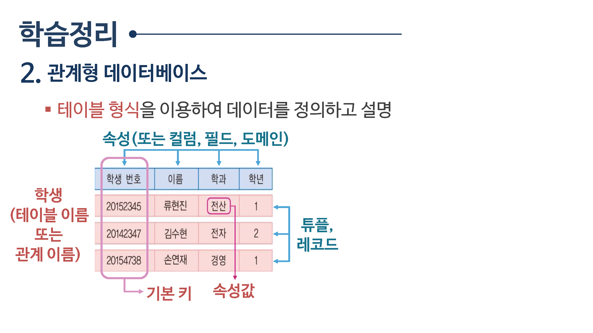

# 데이터베이스

## [데이터베이스](데이터베이스)
데이터베이스

서로 `관련있는 데이터들을 효율적으로 관리`하기 위해 수집된 데이터들의 집합체

* 통합된 데이터 (intergrated data)
* 저장된 데이터 (stored data)
* 운영 데이터 (Operational data)
* 공용데이터 (shared data)

  
## [관계형 데이터베이스](관계형)
관계형 데이터베이스

테이블 형식을 이용하여 데이터를 정의하고 설명

  
## [빅데이터](빅데이터)
빅데이터
기존 데이터보다 너무 방대하여 기존의 방법이나 도구로 수집, 저장, 분석등이 어려운 정형 및 비정형 데이터

6Vs

* 크기(volume)
* 다양성(variety)
* 속도(Velocity)
* 진실성(Veracity)
* 시각화(Visualization)
* 각치(Value)

