# 유무선 통신
5G는 얼마나 빠를까요?

## 01. 유무선 통신방식

### ISDN (Integrated Service Digital Network)

기존의 전화망을 통해 음성 정보(전화)와 데이터를 동시에 보내고자 하는 개념

* Intergrated Service 는 통합 서비스로서 기존의 음성과 디지털 신호를 하나의 전화망 서비스를 통해 제공함
* 기존의 모뎀과는 달리, 전화와 데이터 전송을 위한 독립된 채널로 전화의 사용과는 상관없는 통신이 가능함

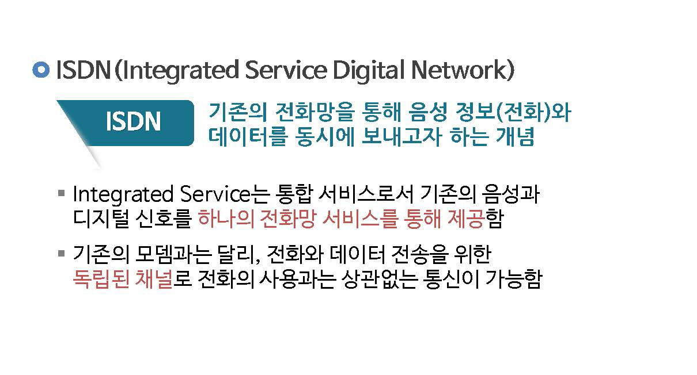

### ADSL (Asymmetric Digital Subscriber Line)

비대칭 디지털 가입자 회선의 약자 / 음성 통화와 고속 인터넷 통신이 동시에 가능한 차세대 접속 서비스

* 기존의 전화선으로 대역을 나누어 음성과 데이터를 동시 전송하는 기술

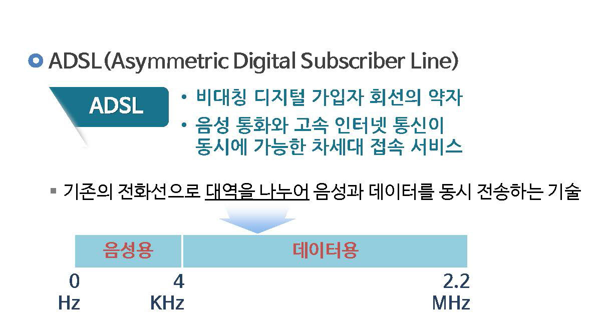

### 블루투스(Bluetooth)

* 1994년 에릭슨이 최초로 개발한 PANs(Personal Area Networks: 개인 근거리 무선통신)를 통한 산업 표준
* IEEE 802.15.1 규격을 사용하며, 전 세계적으로 사용할 수 있는 무선 주파수를 이용하여 서로 다른 다양한 장치들이 안전하고 저렴한 비용으로 서로 통힌할 수 있게 함

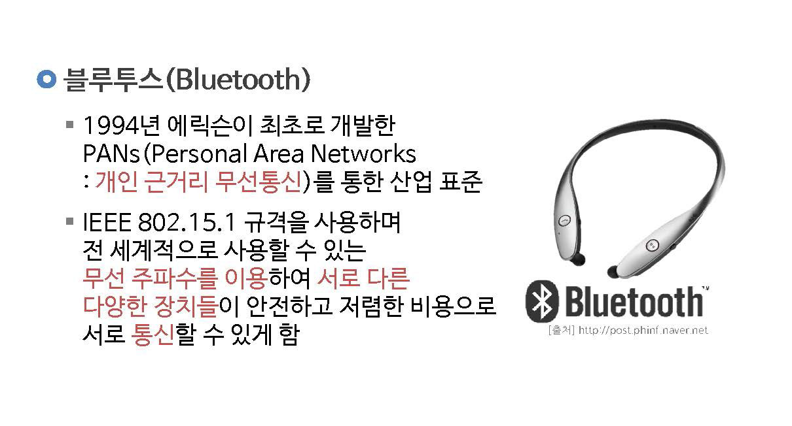

### 와이파이(WIFI)

* IEEE 802.11 기반의 무선 랜 연결과 장치 간 연결 (와이파이 P2P), PAN,LAN,WAN 구성등을 지원하는 일련의 기술
* 무선 접속 장치가 설치된 곳으로 부터 몇 미터에서 몇 백 미터 거리 내에서 고속 인터넷을 무선으로 연결할 수 있는 `근거리 통신망 기술`

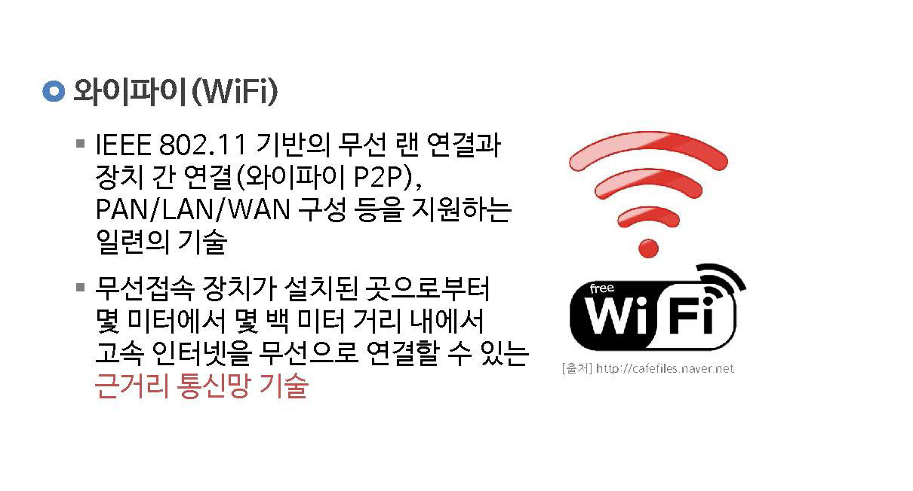

## 02. 이동통신

### 이동통신 (Mobile Communication)

사용자가 자유롭게 이동하는 중에도 계속적인 통신이 가능하도록 해주는 통신 시스템을 말함

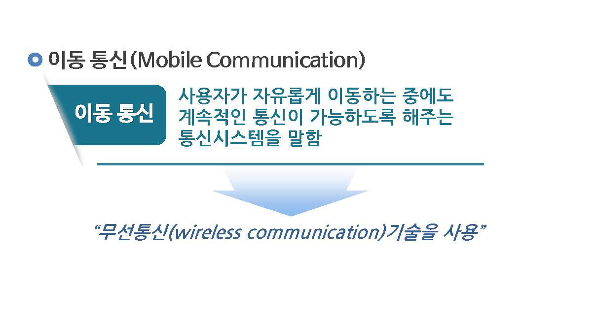

### 이동 통신 진화

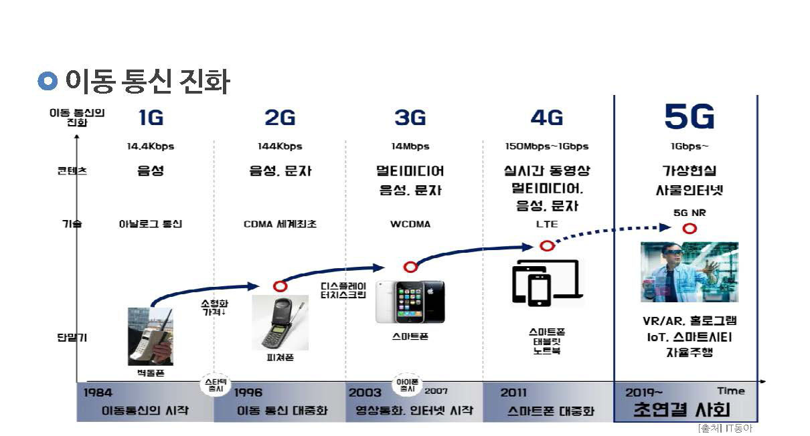

#### 1세대 이동통신 (1G)

아날로그 타입의 셀룰러(cellular) 방식을 사용한 음성통신만 가능한 서비스임

> 셀루러 시스템 : 서비스 지역을 작은 크기의 셀들로 분할하고, 셀 내의 사요자들은 셀 중앙에 설치된 기지국과 통신하는 구조의 이동통신 시스템

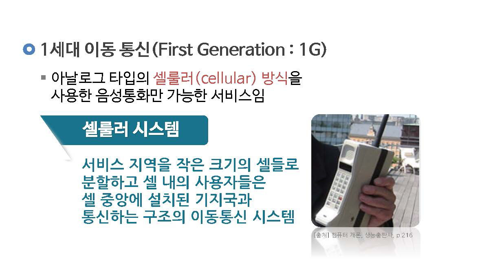

#### 2세대 이동통신

* 미국의 퀄컴(Qualcomm)사가 개발한 디지털 방식의 코드 분할 다중화 접속 방식(CDMA)이란 통신 방식을 사용함
* CDMA 2000은 CDMA보다 `폭넓은 주파수를 사용`하기 때문에 정보를 보다 빠르고 효율적으로 송수신할 수 있으므로, 인터넷 데이터, 비디오, CD 수준의 음악을 빠르게 전송할 수 있게 해줌. 

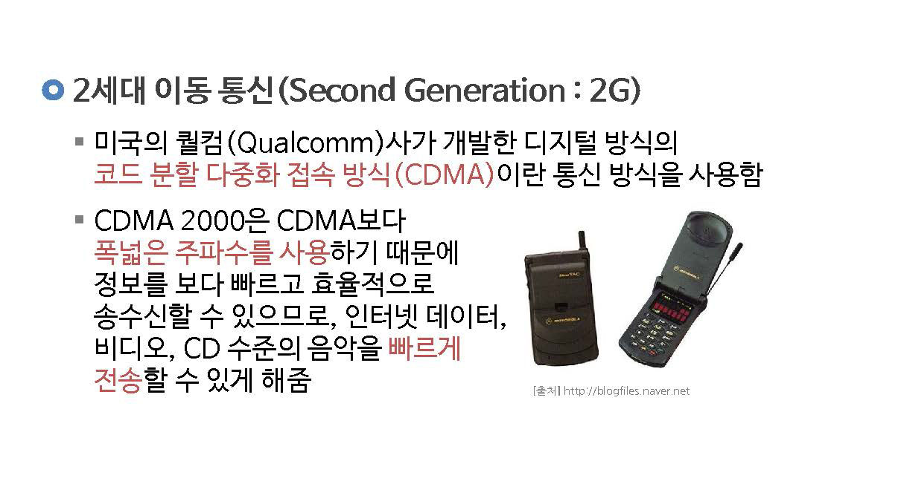

#### 3세대 이동통신

* 1990년대 말부터 문자, 음성, 동화상 등 멀티미디어 데이터를 현재의 유선 인터넷과 비슷한 화질로 전송할 수 있는 특징을 가지고 있음
* IMT-2000 (International Mobile Telecommunication-2000)을 포함하는데, 2GHz 주파수 대역을 이용하여 2~2.4 Mbps의 속도를 제공함 

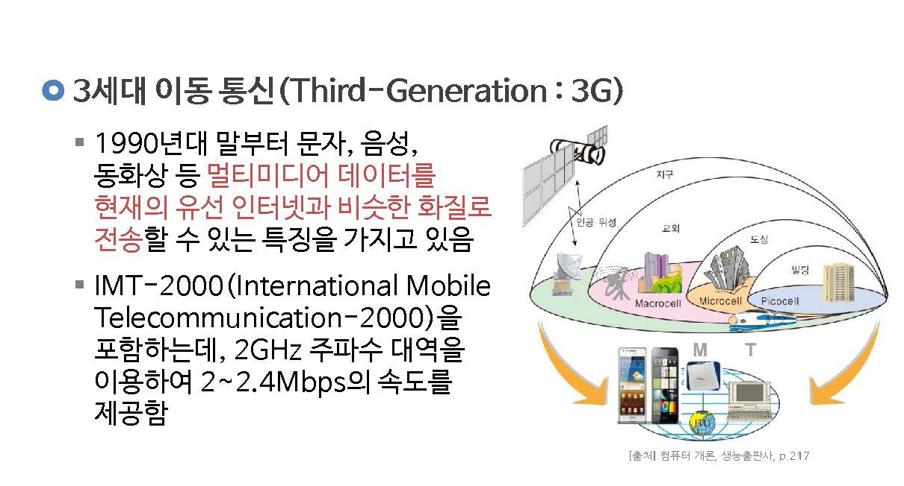

#### 4세대 이동통신

* 무선 이동통신의 네번째 표준으로 4G통신 이라고 함
* 하나의 단말기를 통해 위성망, 무선랜, 인터넷을 모두 사용할 수 있음
* 2011년 7월에 도입된 LTE(long term evolution)
* 2012년 1월 국제 전기 통신 연합은 LTE-Advanced와 Wibro-advanced를 4세대 이동통신 국제 표준으로 채책하였음

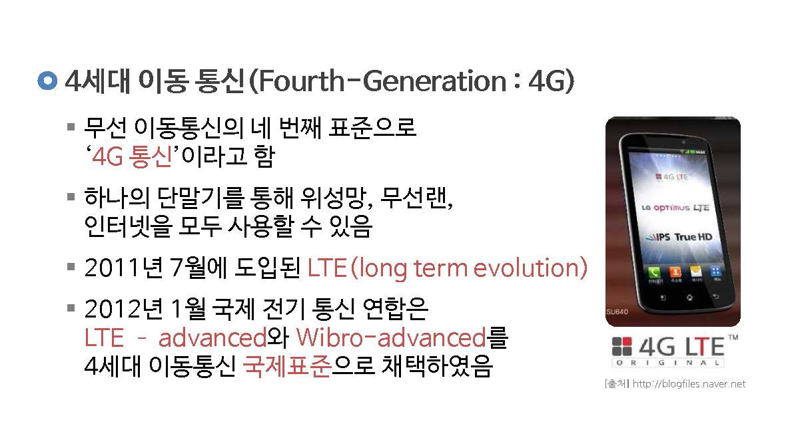

#### 5세대 이동통신

* 총당 1기가 비트 이상의 데이터가 전송되는 초고속 통신 서비스임
* 5세대 이동통신의 사양
  * 최대 1~10Gbps 의 초고속 데이터 처리 속도
  * 1미리 초 이하의 저지연과 품질 안정성
  * 수많은 디바이스의 다중 연결성
  * 확장, 운용, 진화가 용이한 유연성과 저비용의 경제성

* 핵심가치
  * 하드웨어적 발전 / 고객경험 / 연결성 / 지능화 / 효율성 / 신뢰성

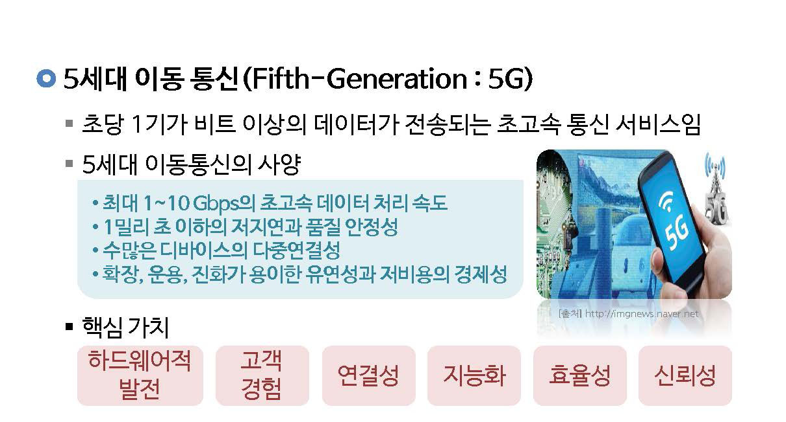

### 이동 통신 세대별 속도 비교

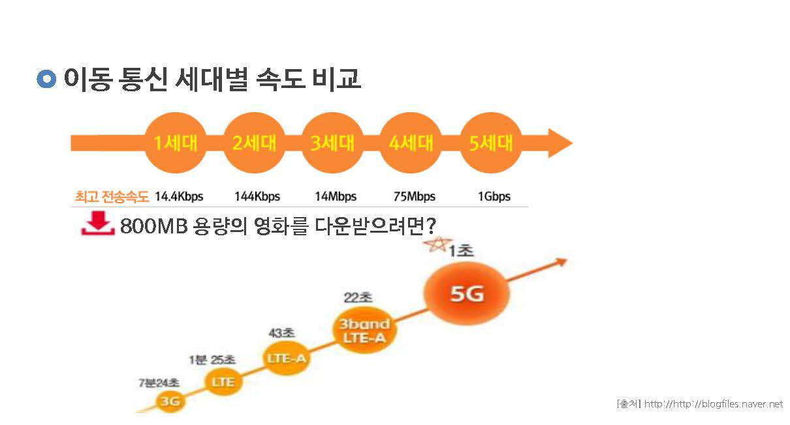

