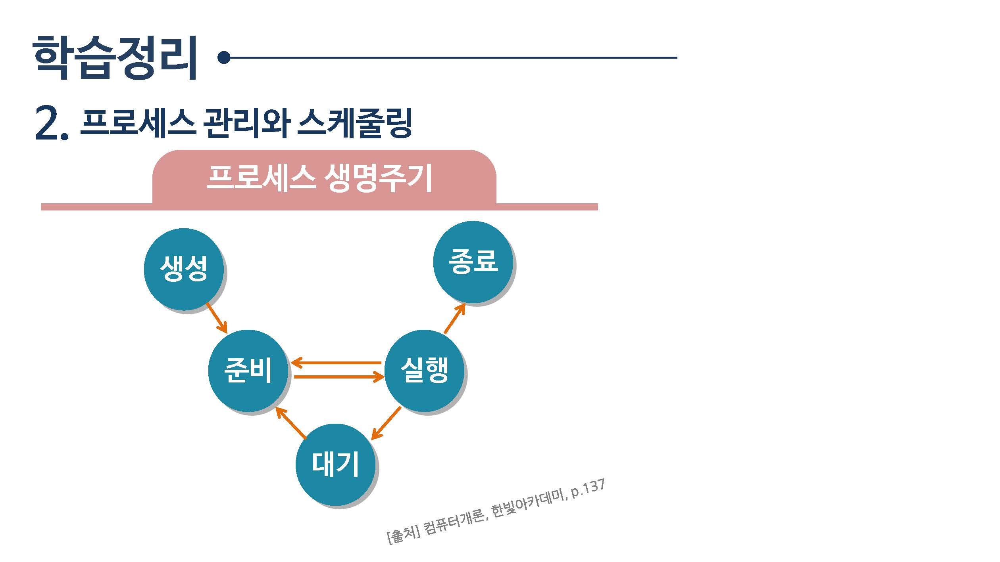

# 운영체제
---

> 심화학습 | [운영체제](os.jiny.dev)

## [운영체제 개요](운영체제개요)

운영체제의 주요 기능은 컴퓨터의 자원을 관리하는 것입니다.

* 프로세스 관리
* 작업관리
* 주기억 장치 관리
* 보조기억장치 관리
* 입출력관리
* 파일관리
* 보안관리

  
## [프로세서 관리와 스케줄링](프로세서)

프로세스 스케쥴링

* FCFS(First-come Forst-served) 스케줄링
* 라운드 로빈(round robin) 스케쥴링
* Shortest-Job-First(SJF
* HRN(Hightest Response ratio Next)

## [주기억장치와 파일 관리](주기억장치)

* 가상 메모리와 페이징
* 페이지 교체 알고리즘
  * FIFO(First-in First-out) 알고리즘
  * LRU(Least Recently Ysed) 알고리즘
  * LFU(Least Frequently Used) 알고리즘

