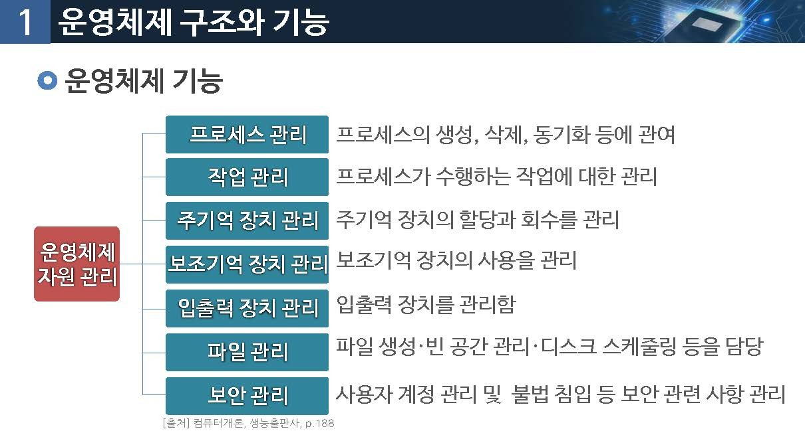
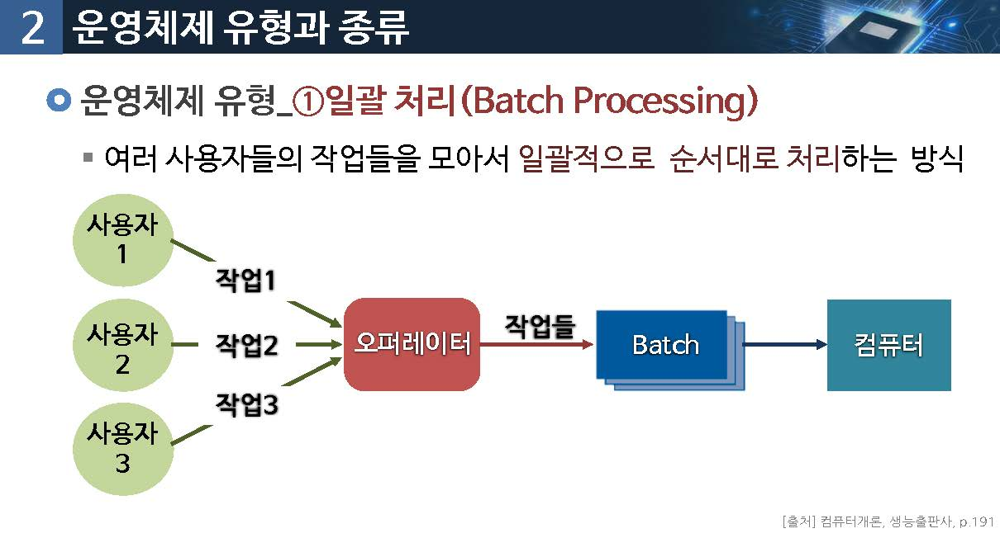

# 운영체제 개요
운영체제가 제공하는 기능은 어떤 것이 있을까요?

## 01.운영체제 구조와 기능

### 운영체제(Operating System)

컴퓨터의 `효율적인 운영을 담당`하는 시스템 소프트웨어

### 운영체제의 목표

* 컴퓨터 내의 하드웨어/소프트웨어 자원을 관리함
* 컴퓨터에 사요자가 쉽게 접근할 수 있는 인터페이스를 제공함
* 수행중인 프로그램들의 효율적인 운영을 도움
* 입출력에 보조적인 기능을 수행함
* 오류가 발생하면 오류를 처리함

### 운영체제 기능

운영체제의 자원관리

* 프로세스 관리 : 프로세스의 생성, 삭제, 동기화 등에 관여
* 작업관리 : 프로세스가 수행하는 작업에 대한 관리
* 주기억장치 관리 : 주기억 장치의 할당과 회수를 관리
* 보조기억장치 관리 : 보조기억장치의 사용을 관리
* 입출력 장치관리 : 입출력 장치를 관리함
* 파일관리 : 파일을 생성, 빈공간관리, 디스크 스케줄링 등을 담당
* 보안관리 : 사용자 계정 및 불법 침입등 보안 관련 사항 관리

### 운영체제 유형

* 일괄처리
* 대화처리
* 다중처리
* 다중 프로그래밍

## 02.운영체제 유형과 종류

### 운영체제 유형 : 일괄처리 (Batch Processing)

여러 사용자들의 작업들을 모아서 `일괄적으로 순서대로 처리`하는 방식

### 대화처리 (Interactive Processing)

중앙의 대형 컴퓨터에 여러 개의 단말기를 연결하여 여러 사용자들의 요구를 대화식으로 처리하는 방식

#### 다중처리(Multi-Processing)

두 개 이상의 프로세서로 구성된 시스템의 운영체제로서, 단일 처리 시스템 보다 많은 양의 작업을 동시에 처리할 수 있는 방식

### 다중 프로그래밍(Multi-Programming)

여러 개의 프로그램들을 동시에 주기억 장치에 적재한 후 , 중앙 처리장리를 쉬게 하지 않고 처리하게 하여 전체적인 처리 속도를 향상시키는 방식

### 운영체제 종료

Windows

* 마이크로소프트사에서 만든 그래픽 사용자 인터페이스(GUI) 운영체제
* 1985년 windows 1.0부터 시작되었으나 1995년 이후 사용되기 시작함
* 2015년 7월 말에 마이크로소프트가 windows 10을 발표했음

Mac

* 1984년 애플사에서 새로 만든 개인용 컴퓨터의 이름을 매킨토시(Macintosh)라고 명명하였는데 통상 맥(Mac)이라고도 불림
* Mac OS 가 탑재된 컴퓨터 시스템 자체를 의마하는 말
* 문서 편집이나 그래픽을 많이 사용하는 분야에서 큰 인기

Unix 운영체제

* Unix는 역사가 매우 오래된 운영체제로서 대기업의 서버용 컴퓨터와 통신용 서버 컴퓨터에 unix 계열의 운영체제가 많이 사용됨

Linux 운영체제

* 1991년 필란드의 헬싱키 대학생이던 리누스 토발즈(Linus Torvalds)가 개발
* Linux의 첫 공식 버전은 1991년 10월에 발표됨
* 전세계의 수많은 개발자들이 linux의 소스코드를 받아 자신이 원하는 기능을 추가하고 다시 인터넷에 공개하는 방식으로 발전해감

### 최근 운영체제의 주요 특징

멀티디이어 자원관리

* 텍스트뿐만 아니라 MIDI, MPEG, JPEG 등의 멀티미디어 파일들을 관리하고 처리함

Windows 및 그래픽 사용자 인처페이스의 일반화

* windows의 메뉴와 마우스 클릭으로 컴퓨터와 인간의 편리한 상호 작용이 가능함

보안 기술 강화

* 컴퓨터들이 네트워크를 통해 개방형으로 운영되므로 접근 제어 기술 및 보안 기술이 강화됨

객체지향 기술이용

* GUI(Graphic User Interface), OLE등의 기술에서 객체지향 기술이 일부 적용됨

Unix의 기능 확장 및 다중화

* unix의 기능이 확장 되었고 다양한 버전이 출현함

Windows의 대중화

windows 제품 군이 대중화되어 pc들 사이에 호환성이 유지됨

Linux 사용의 확대

* PC용 Unix라고 할 수 있는 Linux가 소스(source) 공개 정신을 바탕으로 급속히 확산되어 서버 시장의 상당 부분을 차지하고 있음

