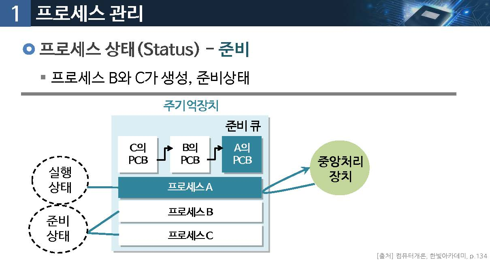
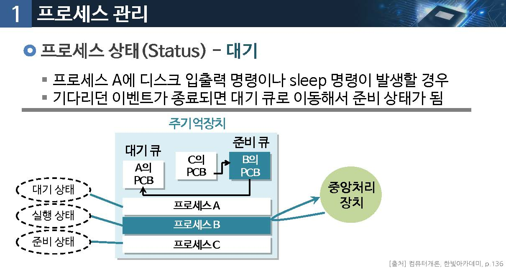

# 프로세스 관리와 스케줄링

운영체제는 어떤 여러 소프트웨어를 동시에 실행 시킬 수 있을까요?

## 01.프로세스 관리

### 프로세스 (Process)

* 실행을 위해서 주기억장치에 올려진 프로그램(운영체제에 의해 관리)
* 프로그램 코드뿐만 아니라 실행에 필요한 다양한 정보도 포함

### 프로세스 제어 블록 (PCB, Process Control Block)

* 운영체제는 프로세스 각각에 대한 정보 관리를 통해 프로세스를 제어함
* 프로세스에 대한 정보는 PCB(Process Control Block)에 저장됨
* 임의의 프로세스가 생성되면 PCB가 생성되며, 프로세스 종료 시 없어짐

### 프로세스 제어 플록(PCB, Process Control Block)

PCB 정보

프로세스의 상태

실행상태인지 또는 실행을 위한 준비 상태인지 등의 정보

프로그램 카운터 값

중앙처리장치의 프로그램 카운터라는 레지스터에 저장된 값으로, 다음에 실행될 명령어의 주기억장치 주소를 의미

스케줄링 정보

다음에 실행될 프로세스를 결정하는데 필요한 정보로, 프로세스 스케줄링 정책, 우선순위 등을 의미

주기억장치 정보

해당 프로세스가 주기억장치의 어느 영역에 위치해 있는지를 정장함

### 프로세스 상태(status)

#### 상태 : 생성

생성된 프소세스의 프로세스 제어 블록이 준비 큐에 연결

중앙처리장치가 프로세스 A를 실행

#### 상태 : 준비

프로세스 B와 C가 생성, 준비상태

#### 상태 : 종료

프로세스 A의 실행이 종료된 경ㅇ

#### 상태 : 대기

* 프로세스 A에 디스크 입출력 명령이나 sleep 명령이 발생할 경우
* 기다리던 이벤트가 종료되면 대기큐로 이동해서 준비 상태가 됨

## 02.프로세스 스케줄링

### 다중 프로그래밍(multi-programming)

* `여러 개의 프로세스를 주기억 장치에 적재`하여 실행중이던 프로세스가 대기하는 경우
* 다른 프로세스가 중앙 처리장치에 의해 `실행` 되도록 하여 `중앙처리장치 이용를을 최대화` 하는 개념

"실행 상태에 있던 프로세스의 실행이 종료되거나, 다른 사건이 발생하기를 기다리기 위해 대기 상태가 되면 실행할 새로운 프로세스를 정해야 함"

### 프로세스 스케줄링(Process Scheduling)

운영체제가 어떤 프로세스를 실행되도록 할 것인지를 결정하는 것

선전기법 (Preemptive)

* 하나의 프로세스가 자원을 점유하고 있을때 다른 프로세스가 이 자원을 빼앗을 수 있는 방식
* 빠른 응답 시간을 요구하는 프로세스들에 저합
* 시작한 작업과 대기중인 작업을 계속 비교 : 많은 오버헤드를 초래함
* Windows 98 이후버젼, Max os

비선점기법(non-preemptive)

* 이미 할당된 자원을 강제로 빼앗지 않고, 그 프로세스가 자원을 반납해야 스케줄링 하는 방식
* 응답시간의 예측이 용이
* 짧은 작업이 긴 작업 뒤에 기다리게 되면 매우 오래 기다리게 됨
* windows 3.x , windows 95

### FCFS (First-Come First-Served) 스케줄링 (비선점)

먼저 도작한 프로세스를 먼저 서비스(실행)하는 방법

### 

평균 대시시간은?

### 라운드 로빈(round robbin) 스케줄링 (선점)

* 여러 프로세스들이 중앙처리장치를 조금씩 돌아가며 할당받아 실행되는 방식
* 프로세스들은 시간 할당량(time quantum)동안 중앙처리장리츨 할당받아 실행

> 시간할당량 안에 실행을 종료하기 못하면, 운영체제에 의해 준비 상태로 전환되고, 준비 큐의 다음 프로세스가 중앙처리장리를 할당받아 실행됨

