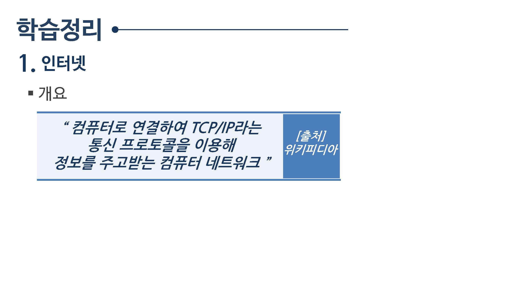
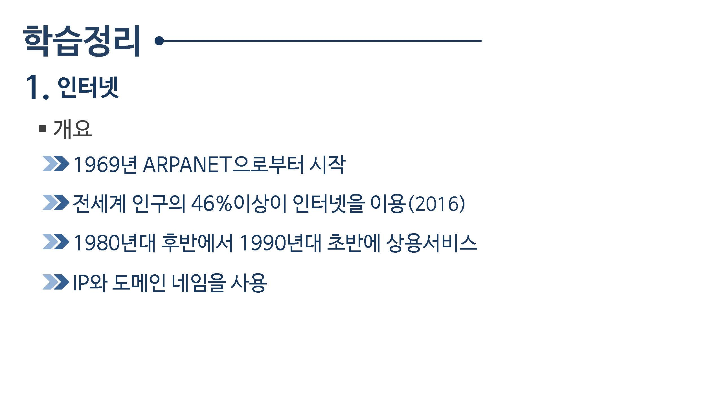
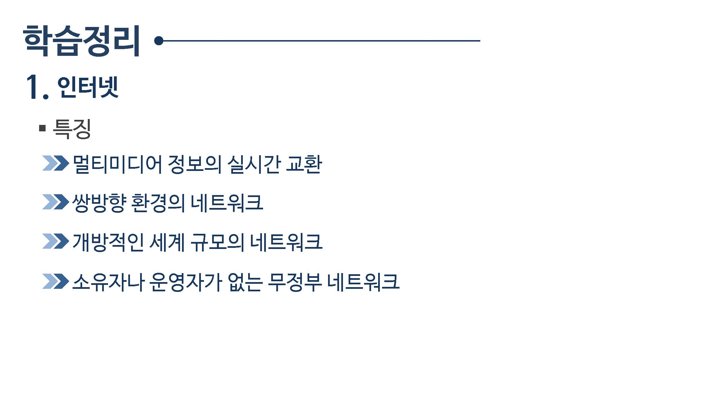
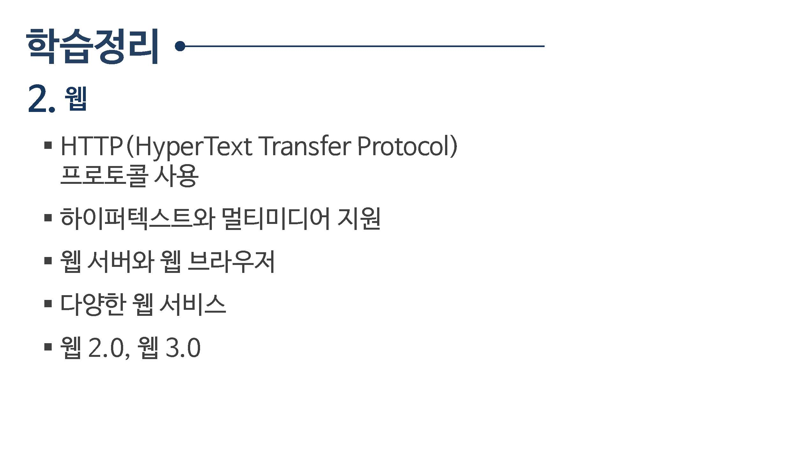

# 09.인터넷과 웹

## 09.1 인터넷

컴퓨터 통신을 기반으로 컴퓨터가 연결됨

LAN 소규모 컴퓨터 연결

### 인터넷의 탄생

인터넷 정의 : 전게계의 수많은 컴퓨터들이 연결되어진 네트워크의 집합체

인터넷은 네트워크의 네트워크라고 함

모든 컴퓨터를 하나의 통신망으로 연결

인터넷의 시작 - ARPANET

미국방서의 지원으로 미국내 4개 대학을 연결

컨퓨터를 연결한 연구 통신망 (1969)

최초의 통신

1969.10.29

UCLA - SRI(스텐포트) 최초 통신

1969.12

UTAH

UCSB

인터넷 용어출연

1973년 TCP/IP 개념 정립

#### 인터넷 확산

#### 인터넷 활용

* 초창기
* 현재
* 개인

> ICT , 기존 IT에 통신(c)를 추가하여 ICT로 확장됨

#### 클라이언트-서버 모델

* 서버 컴퓨터
* 클라이언트 컴퓨터

#### TCP/IP 프로토콜

#### 인터넷주소

컴퓨터에 주소와 이름을 부여하여 컴퓨터를 구분함

NIC

IP 주소와 도메인

#### IP주소

* IPv4
* IPv6

#### 도메인 이름

숫자대신 별칭이나 이름으로 컴퓨터를 표기함

IP 주소를 쉽게 기억할 수 있도록 숫자로 대신 부여

주소표시

xxx.xxx.xxx.xxx

닷(.)으로 각각의 숫자를 구별함

최상의 도메인의 종류

기관 또는 국가명을 사용함

서브도메인의 종류

#### DNS (Domain Name Service)

도메인 이름을 관리합니다.

#### 인터넷의 특징

* 실시간 멀티미디어 정보교환

* 쌍방향 환경의 네트워크
* 개방적 네트워크
* 무정부 네트워크

## 09.2 웹

텍스트 데이터 및 문서

### 09.2.1하이퍼텍스트란

#### 웹(web)

* world wide web 의 첫글자로 www로 표기
* 전세계에 거미줄처럼 연결되어 있다고 해서 web이라 표시

#### 웹의 탄생

팀 버너스리 주도로 개발됨

하이퍼텍스트 개념 도입

최초의 웹브라우저 mosaic

#### 웹기술의 특징

하이퍼텍스트는 노드와 링크로 구성됨
상호 연관있는 텍스트 조작들을 빈순차적으로 연결

#### 웹브라우저(web browser)

하이퍼텍스트 문서를 볼수 있게 하는 도구

웹브라우저 발전

웹서비스

웹 구성요소

* 웹서버
* 웹 클라이언트
* 웹 프로토콜

웹 표준기술

html (hyper text markup language)

웹2.0

웹 3.0

시만틱 웹 기술을 이용

## [인터넷](internet)

## [웹](web)

## 학습정리

